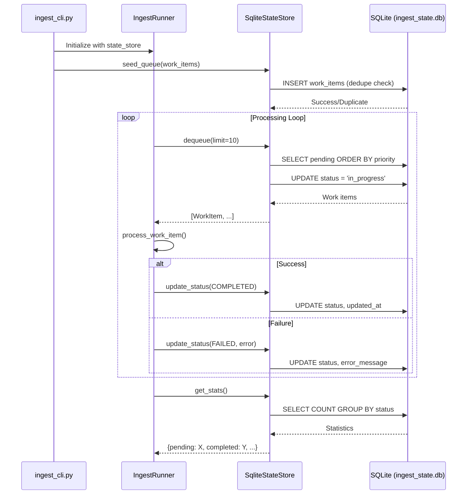

# SQLite State Store (Deprecated)

> **⚠️ DEPRECATED**: This document describes the SQLite-based state store which has been **removed from the default execution path** as of January 2026. The SQLite backend is deprecated and should only be used for local testing or development when SQL Server is unavailable. For production workloads, use the [SQL Server backend](../sqlserver-backend.md).

---

## Table of Contents

1. [Overview](#overview)
2. [What SQLite Powered](#what-sqlite-powered)
3. [Architecture](#architecture)
4. [Database Schema](#database-schema)
5. [Operational Workflow](#operational-workflow)
6. [Integration with Runners](#integration-with-runners)
7. [Integration with Connectors and Discovery](#integration-with-connectors-and-discovery)
8. [Deduplication Logic](#deduplication-logic)
9. [Limitations and Known Issues](#limitations-and-known-issues)
10. [Why We Migrated](#why-we-migrated)
11. [How to Reintroduce SQLite](#how-to-reintroduce-sqlite)
12. [Migration Considerations](#migration-considerations)

---

## Overview

The SQLite state store (`SqliteStateStore`) was the original backend for the Holocron Analytics ingestion framework. It provided a simple, file-based approach to managing:

- **Work queue**: Tracking pending, in-progress, and completed work items
- **Deduplication**: Preventing duplicate processing of resources
- **Run tracking**: Associating work items with ingestion runs
- **State persistence**: Enabling resumable ingestion pipelines

**Status**: Deprecated / Defunct  
**Replacement**: SQL Server State Store (`SqlServerStateStore`)  
**Location**: `src/ingest/state/sqlite_store.py`

---

## What SQLite Powered

The SQLite state store was responsible for:

### 1. Work Queue Management
- Storing work items (requests to fetch resources)
- Tracking item status: `pending`, `in_progress`, `completed`, `failed`, `skipped`
- Priority-based dequeue (lower priority number = higher priority)
- Attempt tracking for retry logic

### 2. Deduplication (Dedupe)
- Preventing duplicate work items from being enqueued
- Using a composite key: `source_system:source_name:resource_type:resource_id`
- Enforced via unique index on `dedupe_key` column

### 3. Run Tracking
- Optional `run_id` field to associate items with ingestion runs
- Enabled batch tracking and run-based analytics

### 4. Discovery Link Tracking
- `discovered_from` field to track parent-child relationships
- Supported link crawling patterns (e.g., discovering wiki page links)

### 5. Error Tracking
- `error_message` field for failed items
- Enabled debugging and retry decisions

---

## Architecture

```
┌─────────────────────────────────────────────────────────────┐
│                    Ingestion Runner                          │
│  ┌─────────────┐  ┌─────────────┐  ┌─────────────┐          │
│  │  Connectors │  │   Storage   │  │  Discovery  │          │
│  │  (fetch)    │  │   Writers   │  │   Plugins   │          │
│  └──────┬──────┘  └──────┬──────┘  └──────┬──────┘          │
│         │                │                │                  │
│         └────────────────┼────────────────┘                  │
│                          │                                   │
│                          ▼                                   │
│              ┌───────────────────────┐                       │
│              │   StateStore (ABC)    │ ◄─── Interface        │
│              └───────────────────────┘                       │
│                          │                                   │
│                          ▼                                   │
│              ┌───────────────────────┐                       │
│              │   SqliteStateStore    │ ◄─── DEPRECATED       │
│              │   (local .db file)    │                       │
│              └───────────────────────┘                       │
└─────────────────────────────────────────────────────────────┘
                           │
                           ▼
                ┌─────────────────────┐
                │  ingest_state.db    │
                │  (SQLite database)  │
                └─────────────────────┘
```

### Component Relationships

1. **IngestRunner** orchestrates the pipeline
2. **StateStore** interface defines the contract
3. **SqliteStateStore** implements the interface using SQLite
4. **Work items** flow through: seed → enqueue → dequeue → process → update status

---

## Database Schema

### Table: `work_items`

The single table storing all work queue data.

#### DDL (CREATE TABLE)

```sql
CREATE TABLE IF NOT EXISTS work_items (
    -- Primary key
    work_item_id TEXT PRIMARY KEY,
    
    -- Source identification
    source_system TEXT NOT NULL,      -- e.g., 'mediawiki', 'http_scrape', 'openalex'
    source_name TEXT NOT NULL,         -- e.g., 'wikipedia', 'wookieepedia'
    resource_type TEXT NOT NULL,       -- e.g., 'page', 'category', 'work'
    resource_id TEXT NOT NULL,         -- External identifier
    
    -- Request details
    request_uri TEXT NOT NULL,         -- Full URI to fetch
    request_method TEXT NOT NULL,      -- HTTP method (GET, POST, etc.)
    request_headers TEXT,              -- JSON-encoded headers
    request_body TEXT,                 -- Request body for POST
    
    -- Metadata
    metadata TEXT,                     -- JSON-encoded metadata
    priority INTEGER NOT NULL DEFAULT 100,  -- Lower = higher priority
    
    -- Status tracking
    status TEXT NOT NULL,              -- pending, in_progress, completed, failed, skipped
    attempt INTEGER NOT NULL DEFAULT 0,  -- Number of fetch attempts
    
    -- Run association
    run_id TEXT,                       -- Optional batch run identifier
    discovered_from TEXT,              -- Parent work item ID (for link discovery)
    
    -- Timestamps
    created_at TEXT NOT NULL,          -- ISO 8601 timestamp
    updated_at TEXT NOT NULL,          -- ISO 8601 timestamp
    
    -- Error tracking
    error_message TEXT,                -- Error message for failed items
    
    -- Deduplication
    dedupe_key TEXT NOT NULL           -- Composite key for uniqueness
);
```

#### Indexes

```sql
-- Queue dequeue optimization (pending items by priority)
CREATE INDEX IF NOT EXISTS ix_work_items_status 
ON work_items (status, priority, created_at);

-- Deduplication enforcement (unique constraint)
CREATE UNIQUE INDEX IF NOT EXISTS ix_work_items_dedupe 
ON work_items (dedupe_key);

-- Run-based queries
CREATE INDEX IF NOT EXISTS ix_work_items_run_id 
ON work_items (run_id);
```

#### Column Details

| Column | Type | Nullable | Description |
|--------|------|----------|-------------|
| `work_item_id` | TEXT | No | UUID v4, primary key |
| `source_system` | TEXT | No | System type (mediawiki, http_scrape, openalex) |
| `source_name` | TEXT | No | Specific source instance |
| `resource_type` | TEXT | No | Type of resource being fetched |
| `resource_id` | TEXT | No | External identifier for deduplication |
| `request_uri` | TEXT | No | Full URL to fetch |
| `request_method` | TEXT | No | HTTP method |
| `request_headers` | TEXT | Yes | JSON-encoded request headers |
| `request_body` | TEXT | Yes | Request body for POST/PUT |
| `metadata` | TEXT | Yes | JSON-encoded arbitrary metadata |
| `priority` | INTEGER | No | Queue priority (lower = higher) |
| `status` | TEXT | No | Current processing status |
| `attempt` | INTEGER | No | Number of processing attempts |
| `run_id` | TEXT | Yes | Batch run identifier |
| `discovered_from` | TEXT | Yes | Parent work item ID |
| `created_at` | TEXT | No | Creation timestamp (ISO 8601) |
| `updated_at` | TEXT | No | Last update timestamp (ISO 8601) |
| `error_message` | TEXT | Yes | Error message for failed items |
| `dedupe_key` | TEXT | No | Composite deduplication key |

---

## Operational Workflow

### 1. Database Initialization

```python
from ingest.state import SqliteStateStore
from pathlib import Path

# SQLite auto-creates the file and schema
state_store = SqliteStateStore(
    db_path=Path("local/state/ingest_state.db"),
    auto_init=True  # Creates tables if missing
)
```

### 2. Seeding the Queue

```python
from ingest.core.models import WorkItem

# Create seed work items
work_item = WorkItem(
    source_system="mediawiki",
    source_name="wikipedia",
    resource_type="page",
    resource_id="Star_Wars",
    request_uri="https://en.wikipedia.org/w/api.php?...",
    request_method="GET",
    priority=10,
    metadata={"seed": True},
)

# Enqueue (returns False if duplicate)
success = state_store.enqueue(work_item)
```

### 3. Processing Work Items

```python
# Dequeue pending items (marks as in_progress)
batch = state_store.dequeue(limit=10)

for item in batch:
    try:
        # Process item...
        result = connector.fetch(item.request_uri)
        
        # Mark as completed
        state_store.update_status(item.work_item_id, WorkItemStatus.COMPLETED)
        
    except Exception as e:
        # Mark as failed
        state_store.update_status(
            item.work_item_id, 
            WorkItemStatus.FAILED,
            error_message=str(e)
        )
```

### 4. Checking Statistics

```python
stats = state_store.get_stats()
# Returns: {'pending': 50, 'in_progress': 5, 'completed': 100, 'failed': 2}
```

### Workflow Diagram



---

## Integration with Runners

### IngestRunner Integration

The `IngestRunner` class uses the state store for:

1. **Queue Management**: `dequeue()` to get work, `update_status()` to track progress
2. **Seeding**: `seed_queue()` to add initial work items
3. **Discovery**: Enqueue newly discovered items from link crawling
4. **Statistics**: `get_stats()` for progress reporting

```python
# From ingest_cli.py
def build_state_store(config: IngestConfig) -> SqliteStateStore:
    state_config = config.get_state_config()
    db_path = Path(state_config.get("db_path", "local/state/ingest_state.db"))
    return SqliteStateStore(db_path=db_path)

# Runner receives state store
runner = IngestRunner(
    state_store=state_store,
    connectors=connectors,
    storage_writers=storage_writers,
    discovery_plugins=discovery_plugins,
)
```

---

## Integration with Connectors and Discovery

### Connector Workflow

1. Runner dequeues work item from SQLite
2. Connector fetches data based on work item's `request_uri`
3. Response is stored via storage writers
4. Status is updated in SQLite

### Discovery Workflow

1. Discovery plugins analyze fetched content
2. New work items are created for discovered links
3. Items are enqueued with `discovered_from` reference
4. Dedupe prevents duplicate entries

```python
# Discovery flow in IngestRunner._process_work_item()
for plugin in self.discovery_plugins:
    discovered_items = plugin.discover(ingest_record, work_item)
    
    for item in discovered_items:
        # Dedupe happens here - returns False if exists
        if self.state_store.enqueue(item):
            enqueued += 1
```

---

## Deduplication Logic

### Dedupe Key Generation

The deduplication key is a composite of four fields:

```python
def get_dedupe_key(self) -> str:
    """Generate a stable key for deduplication."""
    return f"{self.source_system}:{self.source_name}:{self.resource_type}:{self.resource_id}"
```

Examples:
- `mediawiki:wikipedia:page:Star_Wars`
- `mediawiki:wookieepedia:page:Luke_Skywalker`
- `openalex:works:work:W2741809807`

### Enforcement Mechanism

1. **Unique Index**: `ix_work_items_dedupe` on `dedupe_key`
2. **Pre-check**: `exists()` method checks before insert
3. **Race Condition Handling**: `IntegrityError` caught on duplicate

```python
def enqueue(self, work_item: WorkItem) -> bool:
    dedupe_key = work_item.get_dedupe_key()
    
    # Pre-check
    if self.exists(dedupe_key):
        return False
    
    try:
        cursor.execute("INSERT INTO work_items ...")
        return True
    except sqlite3.IntegrityError:
        # Race condition - duplicate inserted between check and insert
        return False
```

---

## Limitations and Known Issues

### 1. Single-Process Concurrency Only

SQLite uses file-level locking. Running multiple ingestion processes against the same database file causes:
- Lock contention
- `database is locked` errors
- Poor performance

**Workaround**: Use `check_same_thread=False` for single-process multi-threading only.

### 2. No True Transaction Isolation

SQLite's WAL mode helps but doesn't provide the same isolation guarantees as SQL Server. Long-running transactions can block readers.

### 3. Limited Scalability

- Single file limits I/O throughput
- No connection pooling
- No query optimization beyond basic indexes

### 4. No Network Access

SQLite is file-based. Running distributed workers requires shared filesystem access (NFS, etc.) which introduces latency and reliability issues.

### 5. Date/Time Handling

SQLite stores timestamps as TEXT (ISO 8601 strings). This requires:
- Manual parsing on read
- String comparison for date filtering (less efficient)

### 6. No Schema Enforcement

SQLite's type affinity is permissive. Invalid data types won't cause insert failures.

### 7. File Management Burden

- Manual backup required
- No built-in replication
- File corruption risk without proper shutdown

---

## Why We Migrated

### Operational Concerns

1. **Multi-worker support**: Need to run multiple ingestion workers concurrently
2. **Scalability**: Production workloads with millions of work items
3. **Reliability**: ACID transactions with proper isolation levels
4. **Monitoring**: Better observability and query tools (SSMS, Azure Data Studio)

### Technical Debt

1. **Inconsistent infrastructure**: SQL Server already used for analytics/storage
2. **Deployment complexity**: Managing SQLite files across environments
3. **Data integrity**: Stronger constraints and type enforcement needed

### Migration Benefits

| Aspect | SQLite | SQL Server |
|--------|--------|------------|
| Concurrency | Single process | Full multi-process |
| Scalability | Limited | Horizontal scaling possible |
| Transactions | Basic | Full ACID with isolation levels |
| Network access | Local file only | TCP/IP connections |
| Monitoring | Manual file inspection | Rich tooling ecosystem |
| Backup | Manual file copy | Built-in backup/restore |

---

## How to Reintroduce SQLite

If you need to use SQLite temporarily (local development, testing, CI without Docker), follow these steps:

### 1. Set Environment Variable

```bash
export DB_BACKEND=sqlite
```

### 2. Configure in YAML (Optional)

```yaml
# config/ingest.yaml
state:
  type: "sqlite"
  db_path: "local/state/ingest_state.db"
```

### 3. Programmatic Selection

```python
from ingest.state import create_state_store

# Explicitly use SQLite (will show deprecation warning)
state_store = create_state_store(
    backend="sqlite",
    db_path="local/state/test.db"
)
```

### 4. Expected Behavior

- A `DeprecationWarning` will be raised
- Log message: "SQLite backend is deprecated..."
- Functionality remains the same

### Known Incompatibilities After Migration

1. **Data not migrated**: SQLite data doesn't auto-migrate to SQL Server
2. **Schema differences**: Some data types differ (TEXT vs NVARCHAR)
3. **Connection strings**: SQLite uses file paths, SQL Server uses connection strings

### When SQLite is Acceptable

- Local development without Docker
- CI/CD testing (ephemeral databases)
- Single-developer workflows
- Learning/experimentation

---

## Migration Considerations

### Data Migration

If you have existing SQLite data that needs to migrate to SQL Server:

1. **Export from SQLite**:
```bash
sqlite3 ingest_state.db ".mode csv" ".headers on" ".output work_items.csv" "SELECT * FROM work_items"
```

2. **Import to SQL Server**:
Use BULK INSERT or a Python script to read CSV and insert into SQL Server.

3. **Verify row counts**:
```sql
-- SQLite
SELECT COUNT(*) FROM work_items;

-- SQL Server
SELECT COUNT(*) FROM [ingest].[work_items];
```

### Rollback Procedure

If SQL Server migration fails and you need to revert:

1. Set `DB_BACKEND=sqlite`
2. Ensure `local/state/ingest_state.db` exists
3. Restart ingestion processes

---

## File Locations

| File | Purpose |
|------|---------|
| `src/ingest/state/sqlite_store.py` | SQLite implementation |
| `src/ingest/core/state_store.py` | Abstract StateStore interface |
| `src/ingest/core/models.py` | WorkItem and related models |
| `config/ingest.example.yaml` | Configuration template |

---

## Deprecation Timeline

| Date | Status |
|------|--------|
| Pre-2026 | SQLite was the default backend |
| January 2026 | SQL Server becomes default; SQLite deprecated |
| Future | SQLite support may be removed entirely |

---

## See Also

- [SQL Server Backend Documentation](../sqlserver-backend.md)
- [Ingestion Framework README](../../src/ingest/README.md)
- [Architecture Diagrams](../diagrams/)
