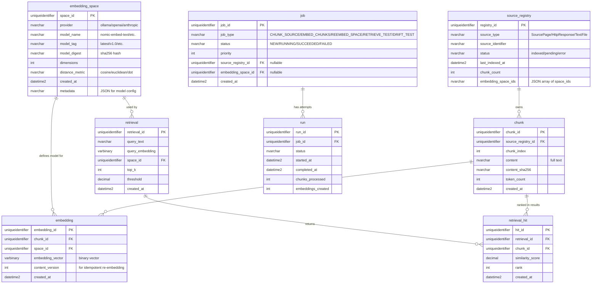

# Data Model Map

**Status:** Phase 0 — Documentation Only  
**Date:** 2026-02-12  
**Purpose:** Comprehensive data model overview for Holocron Analytics with emphasis on LLM expansion pipeline readiness.

---

## Overview

This document provides a data warehouse-style view of the Holocron Analytics database, including:
- **Dimension tables** (entities, tags, embedding spaces)
- **Fact tables** (ingestion records, LLM runs, retrieval queries)
- **Bridge tables** (tag assignments, tag relations, run-evidence linkage)
- **Staging tables** (semantic classification, page signals)
- **Queue tables** (work items, LLM jobs, vector jobs)

The model is organized into **four logical schemas** with clear separation of concerns:
1. **ingest** — Raw data acquisition and work queue
2. **llm** — Chat/interrogation runtime (text-in → text-out)
3. **vector** — Embedding/retrieval runtime (text-in → vectors-out)
4. **sem** — Semantic staging and classification
5. **dbo** — Core dimensional model (entities, tags)

---

## High-Level Architecture

### Schema Relationships


**Legend:**
- 🔵 Blue: Acquisition (ingest)
- 🟡 Yellow: Semantic Staging (sem)
- 🟣 Purple: LLM Runtime (llm)
- 🟢 Green: Vector Runtime (vector)
- 🔴 Red: Core Dimensions (dbo)

---

## Detailed Entity-Relationship Diagrams

### 1. Ingestion & Work Queue Schema (ingest)


**Key Relationships:**
- **work_items → IngestRecords:** 1:N (one work item produces multiple ingest records on retries)
- **ingest_runs → work_items:** 1:N (one run coordinates many work items)
- **seen_resources → work_items:** 1:N (one resource may be requested multiple times, but dedupe_key prevents duplicates)

**Deduplication Strategy:**
- `dedupe_key` = HASH(source_system + resource_id + request_uri)
- Unique constraint on `work_items.dedupe_key` prevents duplicate work items
- `seen_resources` tracks first/last seen times for analytics

---

### 2. Semantic Staging Schema (sem)


**Key Relationships:**
- **SourcePage → PageSignals:** 1:N (multiple signal extractions over time)
- **SourcePage → PageClassification:** 1:N (multiple classifications, e.g., rules then LLM adjudication)
- **PageClassification → llm.run:** N:1 (optional, when LLM-derived)
- **SourcePage → DimEntity:** 1:1 (promoted pages become entities)

**Semantic Flow:**
1. HTTP response → `ingest.IngestRecords`
2. Parse metadata → `sem.SourcePage`
3. Extract cues → `sem.PageSignals` (rules-based)
4. Classify type → `sem.PageClassification` (rules, LLM, or hybrid)
5. Promote → `dbo.DimEntity` (high-confidence, valid types)

---

### 3. LLM Runtime Schema (llm)


**Key Relationships:**
- **job → run:** 1:N (multiple attempts per job, especially on failures)
- **run → artifact:** 1:N (multiple artifacts per run: request, response, evidence, prompt, output, error manifests)
- **run → evidence_bundle:** N:M (via run_evidence bridge table)
- **evidence_bundle → evidence_item:** 1:N (bundle contains multiple evidence items)

**Job Lifecycle:**
1. **Enqueue:** `llm.usp_enqueue_job()` creates job with status=NEW
2. **Claim:** Worker calls `llm.usp_claim_next_job()` → status=RUNNING, worker claims lease
3. **Execute:** Worker creates run via `llm.usp_create_run()`, calls Ollama, writes artifacts
4. **Complete:** `llm.usp_complete_run()` + `llm.usp_complete_job()` → status=SUCCEEDED or FAILED
5. **Retry:** On failure, `current_attempt++`, `backoff_until` set for exponential backoff
6. **Dead Letter:** After `max_attempts`, status=DEADLETTER (requires manual intervention)

**Stored Procedure Contract:**
- All queue operations use stored procedures for atomicity and concurrency safety
- `WITH (READPAST, UPDLOCK)` hints prevent worker contention
- Backoff logic enforced at database level (job not claimable until `backoff_until` expires)

---

### 4. Vector Runtime Schema (vector)



**Key Relationships:**
- **embedding_space → embedding:** 1:N (one model defines many vectors)
- **source_registry → chunk:** 1:N (one source produces many chunks)
- **chunk → embedding:** 1:N (one chunk has embeddings in multiple spaces)
- **embedding:** Unique constraint on `(chunk_id, space_id, content_version)` for idempotency
- **retrieval → retrieval_hit:** 1:N (one query returns ranked results)
- **chunk → retrieval_hit:** 1:N (one chunk appears in many result sets)

**Embedding Space Identity:**
- **Purpose:** Prevent mixing vectors from incompatible models (different dimensions/metrics)
- **Uniqueness:** `(provider, model_name, model_tag, model_digest, dimensions)` must be unique
- **Use Case:** Re-embedding content with new model version creates new space_id, old embeddings preserved

**Content Versioning:**
- `embedding.content_version` tracks chunk content hash at embedding time
- Idempotent re-embedding: If chunk content unchanged, don't re-embed
- Supports drift detection: Compare old vs new embeddings for same content

---

### 5. Core Dimensional Model (dbo)


**Key Relationships:**
- **DimEntity → SourcePage:** N:1 (entity promoted from page, but multiple entities may reference same page during merge resolution)
- **DimEntity → BridgeTagAssignment:** 1:N (entity has many tag assignments)
- **DimTag → BridgeTagAssignment:** 1:N (tag assigned to many targets)
- **DimTag → BridgeTagRelation:** 1:N (tag has relationships to other tags)

**Entity Promotion States:**
- **staged:** Initial state after page classification (not yet reviewed)
- **candidate:** Human or system flagged for promotion consideration
- **adjudicated:** Decision made (promote or suppress)
- **promoted:** Active entity in analytical model
- **suppressed:** Determined not to be entity (e.g., disambiguation page, list page)
- **merged:** Merged into another entity (deduplication)

**Tag Assignment Polymorphism:**
- `TargetType` enum allows tags on: SourcePage, Entity, Chunk, Claim, Event (extensible)
- `TargetID` is string identifier (UUID or integer as string)
- Supports multi-target tagging (e.g., tag both SourcePage and promoted Entity)

---

## Data Warehouse Classification

### Dimensions (Slowly Changing)

| Table | Type | Change Strategy |
|-------|------|----------------|
| **DimEntity** | SCD Type 2 (candidate) | PromotionState tracks lifecycle, PromotionDecisionUtc for temporal slicing |
| **DimTag** | SCD Type 1 | Updates in place, deprecated via Visibility='deprecated' |
| **vector.embedding_space** | SCD Type 0 | Immutable — new model version = new space_id |
| **sem.SourcePage** | SCD Type 1 | ContentHash tracks changes, but page identity (URI) immutable |

### Facts (Event-Based)

| Table | Grain | Accumulating Snapshot |
|-------|-------|----------------------|
| **ingest.IngestRecords** | One row per HTTP fetch attempt | No — immutable records |
| **llm.run** | One row per LLM job execution attempt | No — immutable records |
| **vector.retrieval** | One row per similarity search query | No — immutable audit log |
| **sem.PageClassification** | One row per classification decision | No — history preserved via ClassifiedAt |

### Bridges (Many-to-Many)

| Table | Left Entity | Right Entity | Attributes |
|-------|------------|--------------|-----------|
| **BridgeTagAssignment** | DimTag | SourcePage/Entity/Chunk | Confidence, AssignedAt, AssignmentMethod |
| **BridgeTagRelation** | DimTag | DimTag | RelationType |
| **llm.run_evidence** | llm.run | llm.evidence_bundle | (Simple linkage, no attributes) |
| **vector.retrieval_hit** | vector.retrieval | vector.chunk | similarity_score, rank |

### Staging (Transient or Semi-Persistent)

| Table | Purpose | Retention |
|-------|---------|-----------|
| **ingest.work_items** | Work queue for ingestion | Archived after completion (7+ days) |
| **llm.job** | Work queue for LLM operations | Dead-letter queue for failures, otherwise completed jobs archived |
| **vector.job** | Work queue for vector operations | Similar to llm.job |
| **sem.PageSignals** | Extracted cues for classification | Persistent (used for re-classification) |
| **sem.PageClassification** | Type inference history | Persistent (audit trail) |

---

## Subtype Modeling Patterns

### Entities by Type

**Current State:**
- **Implicit Subtyping:** `DimEntity.PrimaryTypeInferred` and `TypeSetJsonInferred` indicate entity type
- **No Physical Subtypes:** All entities stored in single table (no separate `DimPerson`, `DimLocation`, etc.)
- **Polymorphic Attributes:** No type-specific attributes yet (e.g., `birthdate` for PersonCharacter, `population` for LocationPlace)

**Example:**
```sql
-- Current: All types in one table
SELECT EntityID, EntityName, PrimaryTypeInferred
FROM dbo.DimEntity
WHERE PrimaryTypeInferred = 'PersonCharacter';

-- Missing: Type-specific attributes
-- No columns for PersonCharacter.birthdate, Species.homeworld, etc.
```

**Gap for LLM Expansion:**
- **Need:** Type-specific attribute tables (e.g., `dbo.PersonCharacterFacts`, `dbo.LocationPlaceFacts`)
- **Pattern:** 1:1 relationship with `DimEntity` via `EntityID` FK
- **Alternative:** JSON column `ExtendedAttributes` for flexible schema (less typed, harder to query)

---

### Pages by Type

**Current State:**
- **Explicit Subtyping:** `sem.PageClassification.PrimaryType` with 15 distinct types
- **Type-Specific Attributes:** `WorkMedium` and `CanonContext` columns for WorkMedia pages only
- **Extensibility:** Additional type-specific columns added via migrations (see migration 0022)

**Example:**
```sql
-- Type-specific query
SELECT pc.PageID, sp.Title, pc.WorkMedium, pc.CanonContext
FROM sem.PageClassification pc
JOIN sem.SourcePage sp ON pc.PageID = sp.PageID
WHERE pc.PrimaryType = 'WorkMedia';
```

**Pattern:**
- **Sparse Columns:** Type-specific attributes stored as nullable columns (works for 2-3 attributes per type)
- **Future Consideration:** If many types need >5 attributes each, consider vertical partitioning or JSON

---

## Missing Relationships (Gaps for LLM Expansion)

### 1. Entity-to-Entity Relationships

**Current State:** ❌ No entity relationship tables exist

**Needed for LLM Expansion:**
- `dbo.BridgeEntityRelation` — Many-to-many entity relationships
  - Columns: `RelationID`, `FromEntityID`, `ToEntityID`, `RelationType` (member_of/ally_of/enemy_of/created_by/located_in), `StartDate`, `EndDate`, `Confidence`, `SourceLLMRunID`
- Use Cases: "Luke Skywalker is a member of Rebel Alliance", "Tatooine is located in Outer Rim"

**Example (Missing Table):**
```sql
-- This table does not exist yet
CREATE TABLE dbo.BridgeEntityRelation (
    RelationID INT IDENTITY(1,1) PRIMARY KEY,
    FromEntityID INT NOT NULL FOREIGN KEY REFERENCES dbo.DimEntity(EntityID),
    ToEntityID INT NOT NULL FOREIGN KEY REFERENCES dbo.DimEntity(EntityID),
    RelationType NVARCHAR(50) NOT NULL,
    StartDate NVARCHAR(100),  -- Fuzzy dates (e.g., "22 BBY", "approximately 0 BBY")
    EndDate NVARCHAR(100),
    Confidence DECIMAL(5,4),
    SourceLLMRunID UNIQUEIDENTIFIER,
    CreatedAt DATETIME2 DEFAULT SYSUTCDATETIME()
);
```

---

### 2. Entity-to-Event Relationships

**Current State:** ❌ No event dimension or entity-event bridge exists

**Needed for LLM Expansion:**
- `dbo.DimEvent` — Event dimension (battles, treaties, births, deaths)
  - Columns: `EventID`, `EventName`, `EventType`, `EventDate`, `EventLocation`, `EventDescription`
- `dbo.BridgeEntityEvent` — Entity participation in events
  - Columns: `EntityID`, `EventID`, `ParticipationRole` (combatant/commander/victim/witness)

**Use Cases:** "Luke Skywalker participated in Battle of Yavin as pilot", "Anakin Skywalker born on Tatooine in 41 BBY"

---

### 3. Entity-to-Work Relationships

**Current State:** ❌ No work dimension or entity-work bridge exists

**Needed for LLM Expansion:**
- `dbo.DimWork` — Creative works dimension (films, TV episodes, novels, comics)
  - Columns: `WorkID`, `WorkName`, `WorkType`, `ReleaseDate`, `CanonStatus`
- `dbo.BridgeEntityWork` — Entity appearances in works
  - Columns: `EntityID`, `WorkID`, `AppearanceType` (main_character/supporting/mentioned)

**Use Cases:** "Luke Skywalker appears in 'A New Hope' as main character", "Death Star appears in 'A New Hope' as location"

---

### 4. Multi-Output Fact Tables

**Current State:** ❌ No tables for multi-entity extractions from single source

**Needed for LLM Expansion:**
- **Problem:** Single LLM run may extract N entities from one page (e.g., "List of Jedi" extracts 50 PersonCharacter entities)
- **Need:** Fact table linking `llm.run` → N `dbo.DimEntity` with extracted attributes
- **Pattern:** `dbo.FactEntityExtraction` with columns: `ExtractionID`, `LLMRunID`, `EntityID`, `ExtractedAttributes` (JSON), `Confidence`

**Example (Missing Table):**
```sql
-- This table does not exist yet
CREATE TABLE dbo.FactEntityExtraction (
    ExtractionID INT IDENTITY(1,1) PRIMARY KEY,
    LLMRunID UNIQUEIDENTIFIER NOT NULL,
    EntityID INT NOT NULL FOREIGN KEY REFERENCES dbo.DimEntity(EntityID),
    ExtractedAttributes NVARCHAR(MAX),  -- JSON with LLM-derived facts
    Confidence DECIMAL(5,4),
    CreatedAt DATETIME2 DEFAULT SYSUTCDATETIME()
);
```

---

## Data Flow Diagrams

### End-to-End Data Flow (Current State)


**Key Observations:**
1. **Linear Flow:** Data flows sequentially through schemas (ingest → sem → llm → dbo)
2. **Single Entity Promotion:** One page → one entity (no multi-entity extraction)
3. **No Relationships:** No entity-to-entity, entity-to-event, or entity-to-work bridges populated
4. **Tag Assignments:** Only polymorphic target, no relationships between entities

---

### Desired LLM Expansion Flow (Future State)


**Key Differences from Current State:**
1. **Multi-Output Routing:** One LLM run → N entities + M relations (not just 1:1)
2. **Stored Procedure Routing:** JSON payload → stored proc → multi-table writes (not Python ad hoc inserts)
3. **Identity Resolution:** Dedupe/merge logic before promotion (not just insert)
4. **Relationship Population:** Entity relations, events, works (not just tags)

---

## Related Documentation

- [01-current-state-inventory.md](01-current-state-inventory.md) — Repository and SQL artifact inventory
- [03-workflow-and-runner-map.md](03-workflow-and-runner-map.md) — Process flows and runner orchestration
- [04-functional-gap-analysis.md](04-functional-gap-analysis.md) — Gap analysis for LLM expansion
- [05-recommendations-and-next-steps.md](05-recommendations-and-next-steps.md) — Implementation roadmap
- [../diagrams/mermaid/ERD_Explained.md](../diagrams/mermaid/ERD_Explained.md) — Mermaid diagram conventions
