# Workflow and Runner Map

**Status:** Phase 0 — Documentation Only  
**Date:** 2026-02-12  
**Purpose:** Document current work item lifecycle, runner orchestration patterns, and end-to-end processing flows to inform LLM expansion pipeline design.

---

## Overview

This document maps the operational workflows in Holocron Analytics, including:
- **Work Item Lifecycle:** State transitions and status values across queue systems
- **Runner Orchestration:** How workers claim, process, and complete items
- **End-to-End Flows:** URL discovery → fetch → store → classify → promote
- **Concurrency Patterns:** Lease management, heartbeats, and backoff strategies

The system currently has **three queue systems** with similar but distinct patterns:
1. **ingest.work_items** — HTTP acquisition queue (mature, production-ready)
2. **llm.job** — LLM derivation queue (operational, stored procedure-based)
3. **vector.job** — Vector operations queue (scaffolded, limited usage)

---

## Work Item Lifecycle

### 1. Ingestion Work Queue (ingest.work_items)

#### Status Values

| Status | Meaning | Terminal? | Next States |
|--------|---------|-----------|-------------|
| **pending** | Queued for processing, not yet claimed | No | `in_progress`, `skipped` |
| **in_progress** | Claimed by worker, actively processing | No | `completed`, `failed`, `pending` (on worker death) |
| **completed** | Successfully fetched and stored | Yes | (none) |
| **failed** | Failed after all retry attempts | Yes | `pending` (manual re-queue only) |
| **skipped** | Intentionally skipped (e.g., dedupe, blocked) | Yes | (none) |

#### State Transition Diagram

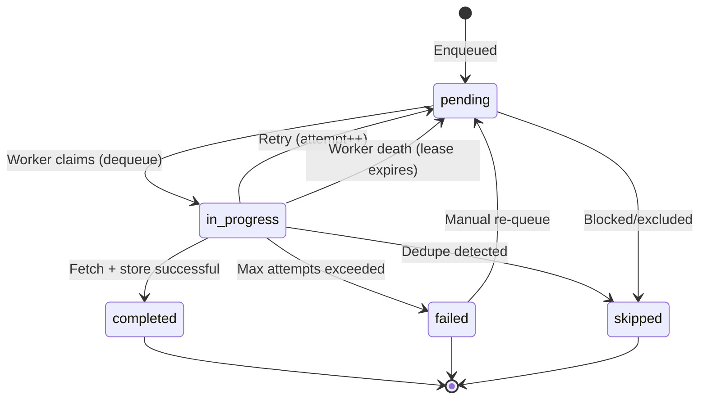

#### Retry Logic

| Field | Purpose | Values |
|-------|---------|--------|
| **attempt** | Current retry count | 0, 1, 2, 3, ... (no hard limit in schema, app enforces max) |
| **error_message** | Last error details | Full exception traceback (truncated to fit NVARCHAR(MAX)) |
| **updated_at** | Last state change | DATETIME2, used for lease expiration detection |

**Retry Strategy:**
- **Immediate Retry:** On transient errors (network timeout, 503 response), retry immediately (no backoff in ingest queue)
- **Max Attempts:** Application-level limit (typically 3-5 attempts)
- **Exponential Backoff:** Not implemented in ingestion queue (future consideration)
- **Dead Letter:** No automatic dead-letter queue; failed items remain in `failed` status for manual review

---

### 2. LLM Job Queue (llm.job)

#### Status Values

| Status | Meaning | Terminal? | Next States |
|--------|---------|-----------|-------------|
| **NEW** | Queued for processing, not yet claimed | No | `RUNNING`, `DEADLETTER` (if expired) |
| **RUNNING** | Claimed by worker, actively processing | No | `SUCCEEDED`, `FAILED`, `NEW` (on timeout/worker death) |
| **SUCCEEDED** | LLM call completed successfully | Yes | (none) |
| **FAILED** | Failed but retries remain | No | `NEW` (after backoff period) |
| **DEADLETTER** | Failed after all retry attempts | Yes | `NEW` (manual re-queue only) |

#### State Transition Diagram

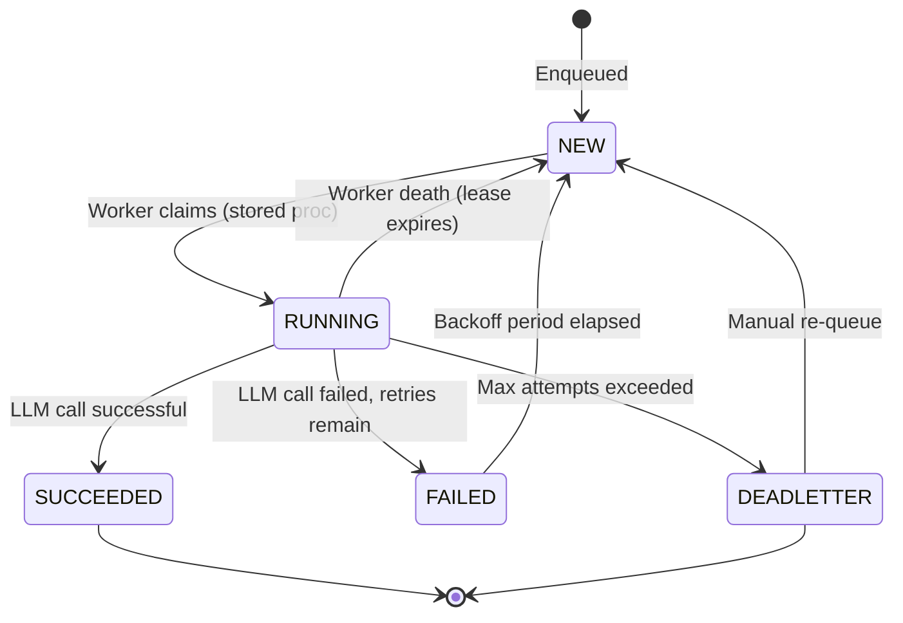

#### Retry Logic

| Field | Purpose | Values |
|-------|---------|--------|
| **current_attempt** | Current retry count | 1, 2, 3, ... |
| **max_attempts** | Maximum retries allowed | Typically 3 (configurable per job type) |
| **backoff_until** | Time when job becomes claimable again | DATETIME2, NULL for NEW jobs |
| **claimed_by** | Worker ID that claimed job | Worker identifier string (e.g., `llm-runner-docker`) |
| **claimed_at** | Time when job was claimed | DATETIME2, used for lease timeout detection |

**Retry Strategy:**
- **Exponential Backoff:** Implemented at database level via `backoff_until` column
  - Attempt 1 fails → `backoff_until` = NOW + 30 seconds
  - Attempt 2 fails → `backoff_until` = NOW + 2 minutes
  - Attempt 3 fails → `backoff_until` = NOW + 10 minutes
  - Attempt 4+ fails → `status = DEADLETTER`
- **Claim Prevention:** `llm.usp_claim_next_job()` respects `backoff_until` — won't claim job until backoff expires
- **Worker Lease Timeout:** If worker doesn't complete within 5 minutes, job auto-released (status → NEW, claimed_by/claimed_at cleared)

---

### 3. Vector Job Queue (vector.job)

#### Status Values

| Status | Meaning | Terminal? | Next States |
|--------|---------|-----------|-------------|
| **NEW** | Queued for processing | No | `RUNNING` |
| **RUNNING** | Claimed by worker | No | `SUCCEEDED`, `FAILED` |
| **SUCCEEDED** | Vector operation completed | Yes | (none) |
| **FAILED** | Operation failed | Yes (for now) | `NEW` (manual re-queue) |

**Note:** Vector job queue is less mature than LLM job queue. Retry/backoff logic not fully implemented.

---

## Runner Orchestration Patterns

### 1. Ingestion Runner Architecture

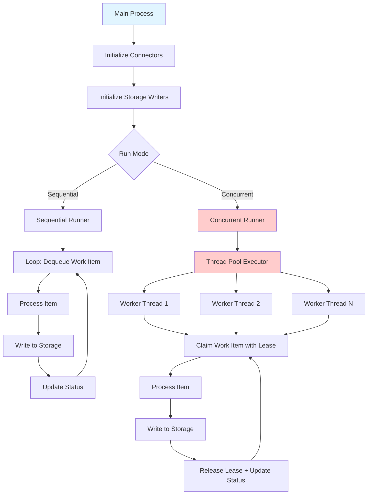

**Key Components:**

| Component | File | Purpose |
|-----------|------|---------|
| **IngestRunner** | `src/ingest/runner/ingest_runner.py` | Main orchestrator, coordinates connectors and storage |
| **ConcurrentRunner** | `src/ingest/runner/concurrent_runner.py` | Thread pool executor with lease-based claiming |
| **SqlServerStateStore** | `src/ingest/state/sqlserver_store.py` | Work queue state management (enqueue, dequeue, update) |
| **Connector (ABC)** | `src/ingest/core/connector.py` | Abstract base for HTTP connectors |
| **StorageWriter (ABC)** | `src/ingest/core/storage.py` | Abstract base for storage backends |

**Execution Flow:**

1. **Initialization:**
   - Load configuration from environment variables
   - Initialize SQL Server connection pool (thread-local)
   - Initialize connectors (e.g., `FandomAPIConnector`)
   - Initialize storage writers (e.g., `FileLakeWriter`, `SqlServerIngestWriter`)

2. **Work Item Claiming:**
   ```python
   # Pseudo-code from ConcurrentRunner
   work_item = state_store.dequeue(
       source_system="wookieepedia_api",
       source_name="fandom",
       statuses=["pending"],
       worker_id="worker-1",
       lease_seconds=300  # 5-minute lease
   )
   ```

3. **Processing:**
   - Connector fetches URL → `IngestRecord` object
   - Storage writers write record (filesystem lake + SQL Server)
   - Discovery logic scans response for new URLs → enqueue as `pending` work items

4. **State Update:**
   ```python
   state_store.update_status(
       work_item_id=work_item.work_item_id,
       status="completed",
       error_message=None
   )
   ```

5. **Lease Management:**
   - Worker heartbeats update `updated_at` timestamp (keeps lease alive)
   - If worker dies, lease expires after 5 minutes → work item auto-released to `pending`

---

### 2. LLM Runner Architecture (Phase 1)

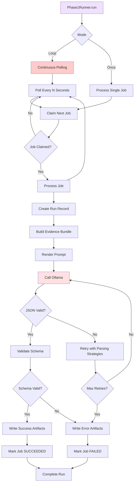

**Key Components:**

| Component | File | Purpose |
|-----------|------|---------|
| **Phase1Runner** | `src/llm/runners/phase1_runner.py` | End-to-end LLM derivation orchestrator |
| **SqlJobQueue** | `src/llm/storage/sql_job_queue.py` | Job queue with stored procedure calls |
| **EvidenceBundleBuilder** | `src/llm/evidence/builder.py` | Assembles evidence from multiple sources |
| **OllamaClient** | `src/llm/providers/ollama.py` | Ollama API wrapper with retry logic |
| **LakeWriter** | `src/llm/storage/lake_writer.py` | Filesystem artifact writer |

**Execution Flow:**

1. **Claim Job:**
   ```python
   job = queue.claim_next_job(worker_id="llm-runner-docker")
   if job is None:
       return  # No jobs available or all in backoff
   ```

2. **Create Run:**
   ```python
   run = queue.create_run(
       job_id=job.job_id,
       worker_id=worker_id,
       model_name="llama3.2"
   )
   ```

3. **Build Evidence:**
   ```python
   evidence_bundle = builder.build(
       job_input=job.input_json,
       evidence_refs=[
           {"type": "lake_http", "source_id": "abc123"},
           {"type": "sql_result", "query": "SELECT ..."}
       ]
   )
   ```

4. **Render Prompt:**
   ```python
   prompt_text = renderer.render(
       template=template,
       evidence=evidence_bundle,
       job_input=job.input_json
   )
   ```

5. **Call LLM:**
   ```python
   response = ollama_client.generate(
       model="llama3.2",
       prompt=prompt_text,
       format="json",  # Structured output
       temperature=0.0
   )
   ```

6. **Validate and Parse:**
   - **Strategy 1:** Direct JSON parse → validate against JSON schema
   - **Strategy 2:** Strip whitespace and retry
   - **Strategy 3:** Extract JSON from markdown code blocks (e.g., ```json ... ```)
   - **Max 3 Attempts:** With exponential backoff (250ms, 1s, 2.5s)

7. **Write Artifacts:**
   ```python
   lake_writer.write_request(run_id, request_json)
   lake_writer.write_response(run_id, response_json)
   lake_writer.write_evidence(run_id, evidence_bundle)
   lake_writer.write_prompt(run_id, prompt_text)
   lake_writer.write_output(run_id, parsed_output)
   ```

8. **Complete Run:**
   ```python
   queue.complete_run(
       run_id=run.run_id,
       status="succeeded",
       prompt_tokens=response.prompt_eval_count,
       completion_tokens=response.eval_count
   )
   ```

9. **Complete Job:**
   ```python
   queue.mark_succeeded(job_id=job.job_id)
   # OR on failure:
   queue.mark_failed(
       job_id=job.job_id,
       error_message=str(e),
       retry_after_seconds=120
   )
   ```

---

### 3. Concurrency and Lease Management

#### Ingestion Queue Concurrency

**Pattern:** Thread-based concurrency with lease-based claiming

```python
# From ConcurrentRunner
with ThreadPoolExecutor(max_workers=num_workers) as executor:
    futures = []
    for worker_id in range(num_workers):
        future = executor.submit(worker_loop, worker_id)
        futures.append(future)
    
    # Wait for all workers
    for future in futures:
        future.result()

def worker_loop(worker_id):
    while True:
        # Claim work item with lease
        work_item = state_store.dequeue(
            worker_id=f"worker-{worker_id}",
            lease_seconds=300
        )
        if work_item is None:
            time.sleep(poll_seconds)
            continue
        
        # Process item
        try:
            process_item(work_item)
            state_store.update_status(work_item.work_item_id, "completed")
        except Exception as e:
            state_store.update_status(
                work_item.work_item_id,
                "failed" if work_item.attempt >= max_attempts else "pending",
                error_message=str(e)
            )
```

**Lease Expiration:**
- Worker updates `updated_at` every N seconds (heartbeat)
- If `updated_at` older than 5 minutes → lease expired → work item auto-released
- Separate cleanup job periodically releases expired leases:
  ```sql
  UPDATE ingest.work_items
  SET status = 'pending', claimed_by = NULL, claimed_at = NULL
  WHERE status = 'in_progress'
    AND DATEDIFF(MINUTE, updated_at, GETUTCDATE()) > 5;
  ```

#### LLM Queue Concurrency

**Pattern:** Stored procedure-based atomic claiming with `READPAST` hints

```sql
-- From llm.usp_claim_next_job
-- Simplified pseudo-code
BEGIN TRANSACTION;

SELECT TOP 1 @job_id = job_id
FROM llm.job WITH (READPAST, UPDLOCK)  -- Skip locked rows, acquire update lock
WHERE status = 'NEW'
  AND (backoff_until IS NULL OR backoff_until <= GETUTCDATE())
ORDER BY priority DESC, created_at ASC;

IF @job_id IS NOT NULL
BEGIN
    UPDATE llm.job
    SET status = 'RUNNING',
        current_attempt = current_attempt + 1,
        claimed_by = @worker_id,
        claimed_at = GETUTCDATE()
    WHERE job_id = @job_id;
END

COMMIT TRANSACTION;
```

**Key Advantages:**
- **No Row Locking:** `READPAST` skips locked rows → workers never wait on each other
- **Atomic Claiming:** Single transaction ensures exactly-once claiming
- **Backoff Enforcement:** Database-level backoff prevents premature retries

**Lease Timeout:**
- Similar to ingestion queue, but timeout enforced by stored procedure:
  ```sql
  -- Auto-release timed-out jobs
  UPDATE llm.job
  SET status = 'NEW', claimed_by = NULL, claimed_at = NULL
  WHERE status = 'RUNNING'
    AND DATEDIFF(MINUTE, claimed_at, GETUTCDATE()) > 5;
  ```

---

## End-to-End Processing Flows

### Flow 1: HTTP Ingestion → Semantic Staging

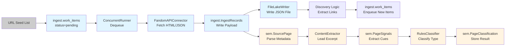

**Step Details:**

| Step | Module | DB Tables | Lake Files |
|------|--------|-----------|-----------|
| **URL Seed** | `src/ingest/seed_loader.py` | `ingest.work_items` INSERT | (none) |
| **Dequeue** | `src/ingest/state/sqlserver_store.py` | `ingest.work_items` UPDATE (status=in_progress) | (none) |
| **Fetch** | `src/ingest/connectors/fandom_connector.py` | (none) | (none) |
| **Store SQL** | `src/ingest/storage/sqlserver.py` | `ingest.IngestRecords` INSERT | (none) |
| **Store Lake** | `src/ingest/storage/file_lake.py` | (none) | `lake/ingest/{source}/{name}/{type}/{id}.json` |
| **Discovery** | `src/ingest/discovery/url_extractor.py` | `ingest.work_items` INSERT (discovered_from FK) | (none) |
| **Parse Page** | `src/semantic/store.py` | `sem.SourcePage` INSERT/UPDATE | (none) |
| **Extract Signals** | `src/semantic/signals_extractor.py` | `sem.PageSignals` INSERT | (none) |
| **Classify** | `src/semantic/rules_classifier.py` | `sem.PageClassification` INSERT | (none) |

**Timing:**
- **Ingestion:** ~2-5 seconds per page (HTTP fetch + storage)
- **Semantic Staging:** ~0.1-0.5 seconds per page (rules-based classification)
- **Total Latency:** < 10 seconds from enqueue to classification

---

### Flow 2: LLM-Driven Page Classification

```mermaid
flowchart LR
    A[sem.PageClassification<br/>NeedsReview=1] --> B[Manual Trigger<br/>or Auto-Enqueue]
    B --> C[llm.job<br/>INSERT job_type='page_classification']
    C --> D[Phase1Runner<br/>Claim Job]
    D --> E[EvidenceBundleBuilder<br/>Load Page Content]
    E --> F[PromptRenderer<br/>Render Template]
    F --> G[OllamaClient<br/>Call LLM]
    G --> H{JSON Valid?}
    H -->|Yes| I[SchemaValidator<br/>Validate Output]
    H -->|No| J[Retry with Strategies]
    J --> G
    I --> K{Schema Valid?}
    K -->|Yes| L[LakeWriter<br/>Write Artifacts]
    K -->|No| M[Write Error Artifacts]
    L --> N[sem.PageClassification<br/>UPDATE with LLM result]
    N --> O[llm.job<br/>status=SUCCEEDED]
    M --> P[llm.job<br/>status=FAILED]
    
    style A fill:#fff4e1
    style C fill:#f0e1ff
    style D fill:#f0e1ff
    style G fill:#ffe1e1
    style L fill:#f0e1ff
    style N fill:#fff4e1
```

**Step Details:**

| Step | Module | DB Tables | Lake Files |
|------|--------|-----------|-----------|
| **Enqueue** | `src/llm/storage/sql_job_queue.py` | `llm.job` INSERT | (none) |
| **Claim** | `src/llm/runners/phase1_runner.py` | `llm.job` UPDATE (status=RUNNING) via stored proc | (none) |
| **Build Evidence** | `src/llm/evidence/builder.py` | `ingest.IngestRecords` SELECT (read payload) | `lake/ingest/**/*.json` (read) |
| **Render Prompt** | `src/llm/prompts/page_classification.py` | (none) | (none) |
| **Call LLM** | `src/llm/providers/ollama.py` | (none) | (none) |
| **Write Artifacts** | `src/llm/storage/lake_writer.py` | `llm.artifact` INSERT | `lake/llm_runs/{yyyy}/{mm}/{dd}/{run_id}/*.json` |
| **Update Classification** | `src/semantic/store.py` | `sem.PageClassification` UPDATE | (none) |
| **Complete Job** | `src/llm/storage/sql_job_queue.py` | `llm.job` UPDATE (status=SUCCEEDED) via stored proc | (none) |

**Timing:**
- **Evidence Assembly:** ~0.5-2 seconds (depends on payload size)
- **LLM Inference:** ~5-30 seconds (depends on model size and hardware)
- **Total Latency:** ~10-40 seconds from job claim to completion

---

### Flow 3: Entity Promotion

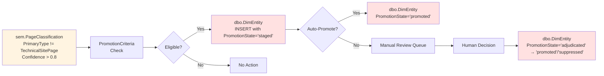

**Promotion Criteria:**
- **Type:** Must be entity-worthy type (PersonCharacter, LocationPlace, etc.) — NOT TechnicalSitePage, ReferenceMeta
- **Confidence:** `sem.PageClassification.Confidence >= 0.8` (high confidence)
- **Uniqueness:** No existing entity with same name (dedupe check)

**Current State:**
- **Auto-Promotion:** Not fully implemented (manual intervention required)
- **Dedupe Logic:** Basic name-based matching (no fuzzy matching or LLM-based identity resolution)

---

## Recovery and Error Handling

### Ingestion Queue Recovery

**Scenario 1: Worker Crash Mid-Processing**

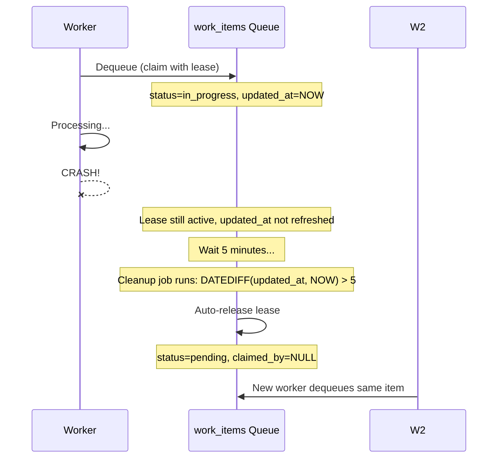

**Recovery Mechanism:**
- **Lease Expiration:** If `updated_at` not refreshed for 5 minutes, assume worker dead
- **Auto-Release:** Scheduled cleanup job resets status to `pending`
- **Idempotency:** Re-processing same item safe (payload stored with unique ingest_id)

---

**Scenario 2: Transient HTTP Error**

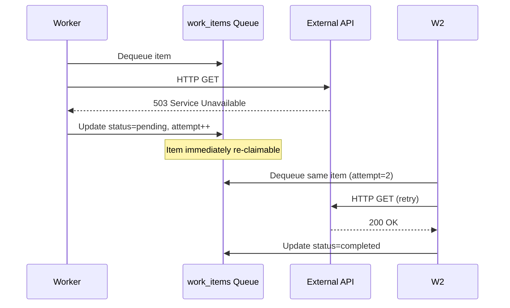

**Recovery Mechanism:**
- **Immediate Retry:** No backoff in ingestion queue (future enhancement)
- **Attempt Tracking:** `attempt` column increments on each retry
- **Max Attempts:** Application-level enforcement (e.g., 3 retries → status=failed)

---

### LLM Queue Recovery

**Scenario 1: JSON Parse Failure**

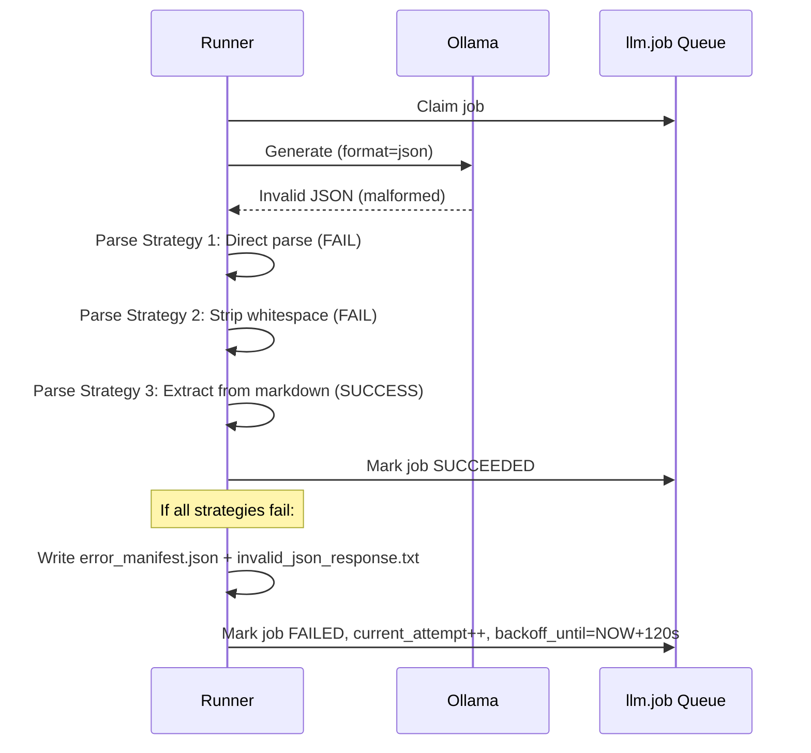

**Recovery Mechanism:**
- **Multi-Strategy Parsing:** 3 parsing strategies before giving up
- **Retry with Backoff:** Failed attempt → backoff → retry (up to max_attempts)
- **Error Artifacts:** On final failure, write diagnostic artifacts to lake

---

**Scenario 2: Backoff and Retry**

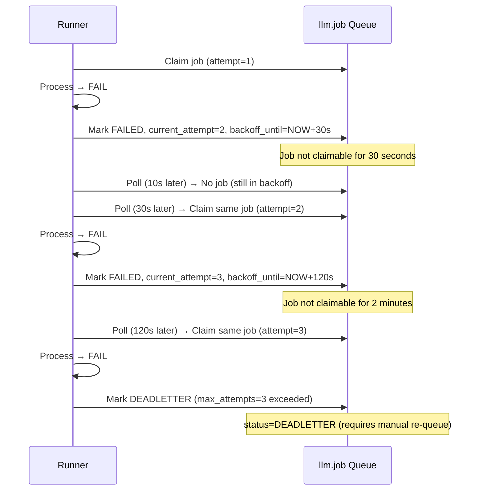

**Backoff Schedule:**
- Attempt 1 → 30 seconds
- Attempt 2 → 2 minutes
- Attempt 3 → 10 minutes
- Attempt 4+ → DEADLETTER

---

## Observability and Monitoring

### Current Logging

| Component | Log Output | Destination |
|-----------|-----------|-------------|
| **IngestRunner** | Work item claim, fetch result, storage result, discovery count | `logs/ingest_{timestamp}.log` |
| **Phase1Runner** | Job claim, evidence assembly, LLM call metrics, artifact writes | `logs/llm_runner_{timestamp}.log` |
| **OllamaClient** | Request/response payloads, token counts, inference time | Embedded in runner logs |

**Logging Levels:**
- `DEBUG` — Full request/response payloads (verbose, use sparingly)
- `INFO` — High-level flow (job claimed, processing started, completed)
- `WARNING` — Retryable errors (HTTP 503, JSON parse failure)
- `ERROR` — Terminal errors (max attempts exceeded, invalid configuration)

---

### Current Metrics (Implicit)

**Database Views:**
- `ingest.vw_queue_summary_by_source` — Work item counts by status and source
- `ingest.vw_pending_failed_work_items` — Items needing retry
- `sem.vw_PagesNeedingReview` — Pages flagged for manual review

**LLM Run Metrics (in llm.run table):**
- `prompt_tokens`, `completion_tokens` — Token usage per run
- `started_at`, `completed_at` — Duration per run
- Aggregate queries:
  ```sql
  SELECT 
      job_type,
      COUNT(*) AS total_runs,
      AVG(DATEDIFF(SECOND, started_at, completed_at)) AS avg_duration_sec,
      SUM(prompt_tokens) AS total_prompt_tokens,
      SUM(completion_tokens) AS total_completion_tokens
  FROM llm.run
  WHERE status = 'succeeded'
  GROUP BY job_type;
  ```

---

### Missing Observability (Gaps)

❌ **Not Yet Implemented:**
- **Prometheus/Grafana Metrics:** No time-series metrics export (future enhancement)
- **Structured Logging:** Logs are plaintext, not JSON (harder to parse)
- **Distributed Tracing:** No correlation IDs across runner → LLM → storage
- **Alerting:** No automated alerts on queue depth, error rate, latency spikes
- **Dashboards:** No real-time queue health visualization

---

## Related Documentation

- [01-current-state-inventory.md](01-current-state-inventory.md) — Repository and SQL artifact inventory
- [02-data-model-map.md](02-data-model-map.md) — Data model and ERD
- [04-functional-gap-analysis.md](04-functional-gap-analysis.md) — Gap analysis for LLM expansion
- [05-recommendations-and-next-steps.md](05-recommendations-and-next-steps.md) — Implementation roadmap
- [../llm/phase1-runner.md](../llm/phase1-runner.md) — Phase 1 runner deep dive
- [../llm/operational.md](../llm/operational.md) — Operational runbook
