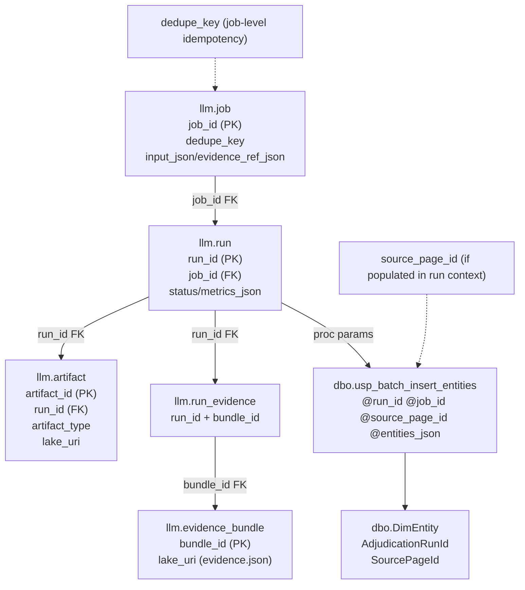
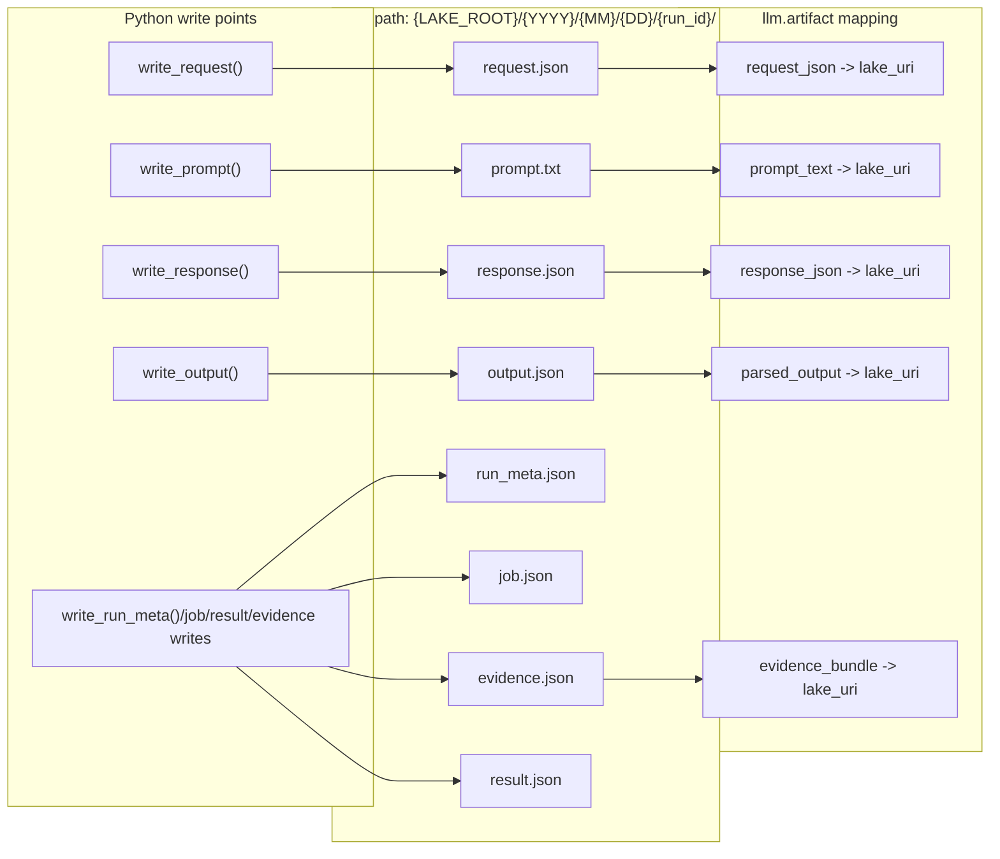
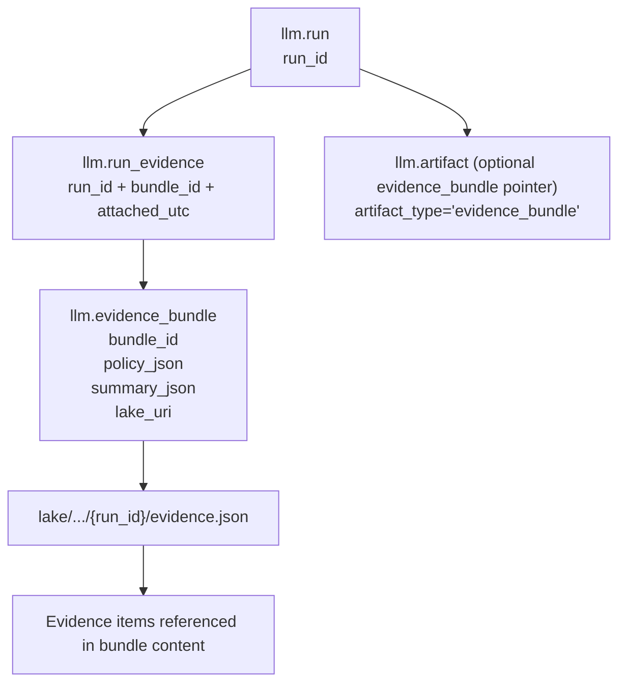
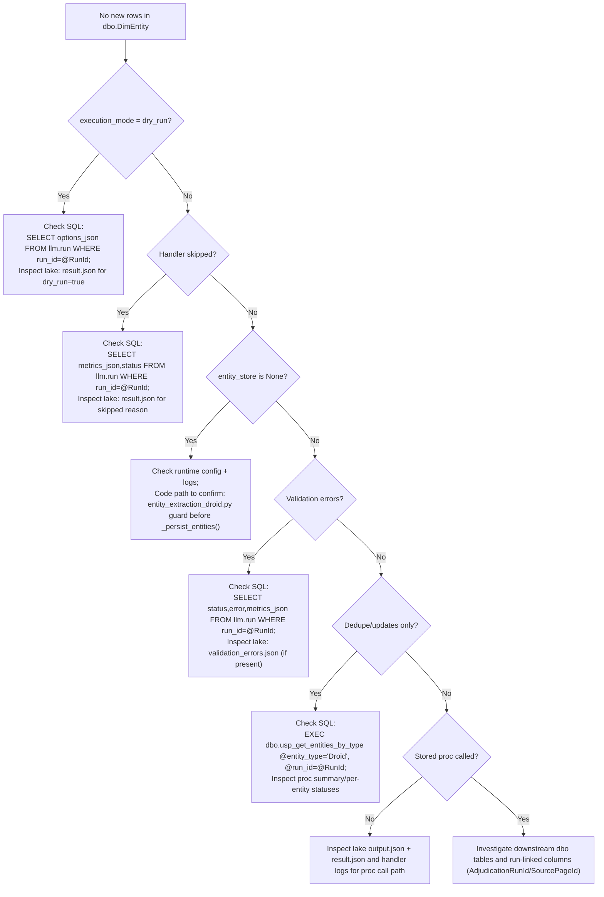
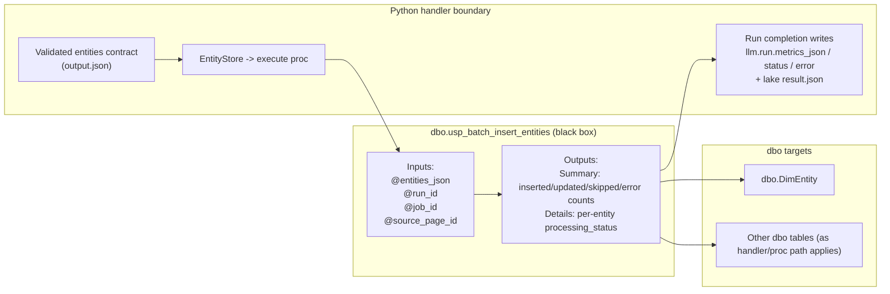

# LLM Pipeline Observability — Current State Review

> **Document Purpose**: This document describes the *exact* current behavior of the LLM/Ollama pipeline end-to-end, identifying where artifacts are stored, how runs are correlated, and any observability gaps.
>
> **Non-goals**: This is a read-only investigation. No schema, stored procedures, Python runners, prompts, contracts, or payloads should be changed as part of this review.

## Executive Summary

The holocron-analytics LLM pipeline has **comprehensive observability** built-in by design:

| Artifact Type | Storage Location | Exists? |
|---------------|------------------|---------|
| Full outgoing request payload | Filesystem lake (`request.json`) + `llm.artifact` DB pointer | ✅ YES |
| Full incoming response payload | Filesystem lake (`response.json`) + `llm.artifact` DB pointer | ✅ YES |
| Rendered prompt/messages | Filesystem lake (`prompt.txt`) + `llm.artifact` DB pointer | ✅ YES |
| Model + inference params | `llm.run.options_json`, `llm.run.model_name`, `llm.run.model_tag` | ✅ YES |
| Contract payload passed into stored proc | Filesystem lake (`output.json`) + `llm.artifact` DB pointer | ✅ YES |
| Stored proc return status/result | `llm.run.status`, `llm.run.metrics_json`, `llm.run.error` | ✅ YES |
| Per-table insert/update counts | `dbo.usp_batch_insert_entities` returns summary JSON | ✅ YES |
| Dedupe outcome details | `dbo.usp_batch_insert_entities` returns per-entity status | ✅ YES |

---

## Visual Reference Pack (Mermaid + draw.io)

Draw.io source files (presentation format):

- `docs/llm/diagrams/llm_observability_system_context.drawio`
- `docs/llm/diagrams/llm_observability_correlation_chain.drawio`
- `docs/llm/diagrams/llm_observability_artifact_lifecycle.drawio`
- `docs/llm/diagrams/llm_observability_evidence_linkage.drawio`
- `docs/llm/diagrams/llm_observability_no_new_rows_troubleshooting.drawio`
- `docs/llm/diagrams/llm_observability_stored_proc_boundary.drawio`

> Open `.drawio` files in diagrams.net (draw.io). SVG exports are not included in this revision.

### 1) System context flow (Python / Ollama / SQL / filesystem lake)

```mermaid
flowchart LR
  subgraph PY[Python runtime]
    DISP["dispatcher.py / handlers"]
    QUEUE["sql_job_queue.py"]
    LAKEW["lake_writer.py"]
  end
  subgraph OLL[Ollama API]
    OCHAT["/api/chat or /api/generate"]
  end
  subgraph SQL[SQL Server]
    subgraph LLM[llm schema]
      JOB["llm.job"]
      RUN["llm.run"]
      ART["llm.artifact"]
      EB["llm.evidence_bundle"]
      RE["llm.run_evidence"]
    end
    subgraph DBO[dbo schema]
      PROC["dbo.usp_batch_insert_entities"]
      DIM["dbo.DimEntity (+ downstream dbo tables)"]
    end
  end
  subgraph LAKE[Filesystem lake]
    ROOT["{LAKE_ROOT}/YYYY/MM/DD/{run_id}/..."]
  end

  QUEUE -->|claim/create| JOB
  JOB --> RUN
  DISP --> OCHAT
  DISP --> LAKEW
  LAKEW -->|request/response/prompt/output/result files| ROOT
  LAKEW -->|artifact pointers| ART
  DISP -->|attach evidence| EB
  RUN --> RE
  EB --> RE
  DISP -->|@entities_json, @run_id, @job_id, @source_page_id| PROC
  PROC --> DIM
  PROC -->|summary/per-entity status| RUN
```

### 2) Correlation chain (IDs and joins)



### 3) Artifact lifecycle (write points + mapping)



### 4) Evidence linkage



### 5) Troubleshooting decision tree: “No new rows in dbo”



### 6) Stored procedure boundary



### Debugging checklist (diagram-first)

- [ ] Start with **Correlation chain** to identify `run_id`/`job_id` and join path.
- [ ] Use **Artifact lifecycle** to locate exact files via `llm.artifact.lake_uri`.
- [ ] Use **Evidence linkage** to confirm `llm.run_evidence` and evidence bundle attachment.
- [ ] Use **Stored procedure boundary** to isolate Python input vs SQL output behavior.
- [ ] Use **No new rows** decision tree for focused SQL/artifact checks.

### Discrepancies / to confirm

- `llm.artifact.artifact_type` naming vs file naming should be treated separately (example: `parsed_output` points to `output.json`); confirm no additional active artifact types per handler path.
- `source_page_id` is shown as conditional because it depends on job/run context and handler path; confirm population behavior for the specific interrogation/job type under investigation.

---

## Part A: End-to-End Traceability Map

### Correlation Chain

```
Command/Enqueue
     │
     ▼
┌─────────────────────────────────────────────────────────────────────┐
│ llm.job                                                             │
│   job_id: UNIQUEIDENTIFIER (primary key)                            │
│   interrogation_key: e.g., "entity_extraction_droid_v1"             │
│   input_json: JSON with entity_id, content, source metadata         │
│   evidence_ref_json: references to evidence sources                 │
│   dedupe_key: idempotency key (if provided)                         │
│   status: NEW → RUNNING → SUCCEEDED/FAILED/DEADLETTER               │
└─────────────────────────────────────────────────────────────────────┘
     │ claimed by usp_claim_next_job
     ▼
┌─────────────────────────────────────────────────────────────────────┐
│ llm.run                                                             │
│   run_id: UNIQUEIDENTIFIER (primary key)                            │
│   job_id: FK → llm.job                                              │
│   worker_id: which worker processed this                            │
│   ollama_base_url: e.g., "http://ollama:11434"                      │
│   model_name, model_tag, model_digest: model identification         │
│   options_json: {"temperature": 0.0, "execution_mode": "live"}      │
│   metrics_json: LLM timing metrics (after completion)               │
│   status: RUNNING → SUCCEEDED/FAILED                                │
│   started_utc, completed_utc: timestamps                            │
└─────────────────────────────────────────────────────────────────────┘
     │ artifacts written during run
     ▼
┌─────────────────────────────────────────────────────────────────────┐
│ llm.artifact                                                        │
│   artifact_id: UNIQUEIDENTIFIER                                     │
│   run_id: FK → llm.run                                              │
│   artifact_type: 'request_json' | 'response_json' | 'evidence_bundle'│
│                  'prompt_text' | 'parsed_output' | 'raw_response'   │
│   lake_uri: relative path to file in lake                           │
│   content_sha256: hash of file contents                             │
│   byte_count: file size                                             │
└─────────────────────────────────────────────────────────────────────┘
     │ evidence bundle linking
     ▼
┌─────────────────────────────────────────────────────────────────────┐
│ llm.evidence_bundle                                                 │
│   bundle_id: UNIQUEIDENTIFIER                                       │
│   policy_json: redaction/bounding policy used                       │
│   summary_json: bundle summary metadata                             │
│   lake_uri: path to evidence bundle JSON                            │
└─────────────────────────────────────────────────────────────────────┘
     │ 
     ▼
┌─────────────────────────────────────────────────────────────────────┐
│ llm.run_evidence (join table)                                       │
│   run_id: FK → llm.run                                              │
│   bundle_id: FK → llm.evidence_bundle                               │
│   attached_utc: when bundle was attached to run                     │
└─────────────────────────────────────────────────────────────────────┘
     │ parsed output passed to stored procedure
     ▼
┌─────────────────────────────────────────────────────────────────────┐
│ dbo.usp_batch_insert_entities                                       │
│   Input: @entities_json, @run_id, @job_id, @source_page_id          │
│   Output: inserted_count, updated_count, skipped_count, error_count │
│   Per-entity: processing_status (inserted/updated/skipped/error)    │
└─────────────────────────────────────────────────────────────────────┘
     │
     ▼
┌─────────────────────────────────────────────────────────────────────┐
│ dbo.DimEntity                                                       │
│   EntityKey: INT identity                                           │
│   AdjudicationRunId: FK-like reference to llm.run.run_id            │
│   SourcePageId: source page reference                               │
│   PromotionState: 'staged' | 'candidate' | 'promoted'               │
│   ... entity attributes ...                                         │
└─────────────────────────────────────────────────────────────────────┘
```

### Filesystem Lake Structure

Artifacts are written to a structured directory hierarchy by `LakeWriter`:

```
{LAKE_ROOT}/                           # Default: lake/llm_runs
└── {YYYY}/
    └── {MM}/
        └── {DD}/
            └── {run_id}/
                ├── request.json       # Full Ollama request payload
                ├── response.json      # Full Ollama response
                ├── evidence.json      # Evidence bundle used
                ├── prompt.txt         # Rendered prompt text
                ├── output.json        # Parsed/validated output
                ├── job.json           # Job metadata
                ├── run_meta.json      # Run context metadata
                └── result.json        # Final handler result
```

Environment variable: `LAKE_ROOT` (default: `lake/llm_runs`)

---

## Part B: What Exists Today (with Exact Pointers)

### 1. Full Outgoing Request Payload

| Question | Answer |
|----------|--------|
| **Is it stored?** | ✅ YES |
| **SQL Location** | `llm.artifact` row with `artifact_type = 'request_json'` |
| **Filesystem Location** | `{LAKE_ROOT}/{YYYY}/{MM}/{DD}/{run_id}/request.json` |
| **Content** | Full JSON payload sent to Ollama including: model, messages[], stream, format, options |

**Code Reference**: `src/llm/storage/lake_writer.py:216-233` (`write_request()`)

### 2. Full Incoming Response Payload

| Question | Answer |
|----------|--------|
| **Is it stored?** | ✅ YES |
| **SQL Location** | `llm.artifact` row with `artifact_type = 'response_json'` |
| **Filesystem Location** | `{LAKE_ROOT}/{YYYY}/{MM}/{DD}/{run_id}/response.json` |
| **Content** | Full JSON response from Ollama including: model, message, done, context, metrics |

**Code Reference**: `src/llm/storage/lake_writer.py:235-252` (`write_response()`)

### 3. Rendered Prompt/Messages

| Question | Answer |
|----------|--------|
| **Is it stored?** | ✅ YES |
| **SQL Location** | `llm.artifact` row with `artifact_type = 'prompt_text'` |
| **Filesystem Location** | `{LAKE_ROOT}/{YYYY}/{MM}/{DD}/{run_id}/prompt.txt` |
| **Content** | Final rendered prompt text after template substitution |

**Code Reference**: `src/llm/storage/lake_writer.py:273-290` (`write_prompt()`)

### 4. Model + Inference Parameters

| Question | Answer |
|----------|--------|
| **Is it stored?** | ✅ YES |
| **SQL Location** | `llm.run` columns: `model_name`, `model_tag`, `model_digest`, `options_json` |
| **Content** | Model identification and inference parameters (temperature, execution_mode, etc.) |

**SQL Query to Inspect**:
```sql
SELECT 
    run_id,
    job_id,
    model_name,
    model_tag,
    model_digest,
    options_json,
    started_utc,
    completed_utc,
    status
FROM llm.run
ORDER BY started_utc DESC;
```

### 5. Contract Payload Passed into Stored Procedure

| Question | Answer |
|----------|--------|
| **Is it stored?** | ✅ YES |
| **SQL Location** | `llm.artifact` row with `artifact_type = 'parsed_output'` |
| **Filesystem Location** | `{LAKE_ROOT}/{YYYY}/{MM}/{DD}/{run_id}/output.json` |
| **Content** | Validated JSON output that matches the contract schema |

**Code Reference**: `src/llm/storage/lake_writer.py:292-309` (`write_output()`)

### 6. Stored Procedure Return Status/Result

| Question | Answer |
|----------|--------|
| **Is it stored?** | ✅ YES |
| **SQL Location** | `llm.run.status`, `llm.run.metrics_json`, `llm.run.error` |
| **Additional** | Handler result written to `result.json` in lake |

**SQL Query to Inspect Run Outcomes**:
```sql
SELECT 
    r.run_id,
    j.job_id,
    j.interrogation_key,
    r.status,
    r.metrics_json,
    r.error,
    r.started_utc,
    r.completed_utc
FROM llm.run r
JOIN llm.job j ON r.job_id = j.job_id
ORDER BY r.started_utc DESC;
```

### 7. Per-Table Insert/Update Counts

| Question | Answer |
|----------|--------|
| **Is it stored?** | ✅ YES (when stored proc is called) |
| **SQL Location** | Returned by `dbo.usp_batch_insert_entities` as result set |
| **Storage** | Captured in handler's `metrics_json` field in `llm.run` |

**Stored Procedure Output Structure**:
```sql
-- First result set: summary
SELECT 
    @inserted_count AS inserted_count,
    @updated_count AS updated_count,
    @skipped_count AS skipped_count,
    @error_count AS error_count,
    NULL AS error_message,
    'SUCCESS' AS status;

-- Second result set: per-entity details
SELECT
    row_num,
    entity_name,
    entity_type,
    confidence,
    processing_status,    -- 'inserted' | 'updated' | 'skipped' | 'error'
    existing_entity_id,
    error_message
FROM #ParsedEntities
ORDER BY row_num;
```

### 8. Dedupe Outcome Details

| Question | Answer |
|----------|--------|
| **Is it stored?** | ✅ YES |
| **Job-level dedupe** | `llm.job.dedupe_key` column + `usp_enqueue_job_idempotent` |
| **Entity-level dedupe** | `dbo.usp_batch_insert_entities` returns `processing_status = 'updated'` for existing entities |

**SQL Query for Job Dedupe**:
```sql
SELECT 
    job_id,
    interrogation_key,
    dedupe_key,
    status,
    created_utc
FROM llm.job
WHERE dedupe_key IS NOT NULL
ORDER BY created_utc DESC;
```

**Entity Dedupe Logic** (in `dbo.usp_batch_insert_entities`):
- Case-insensitive match on `DisplayName + EntityType`
- Existing entities are **updated** (not duplicated)
- Returns `processing_status = 'updated'` with `existing_entity_id`

---

## Part C: Artifact Retrieval Queries

### Find All Artifacts for a Run

```sql
DECLARE @RunId UNIQUEIDENTIFIER = 'your-run-id-here';

SELECT 
    a.artifact_id,
    a.artifact_type,
    a.lake_uri,
    a.content_sha256,
    a.byte_count,
    a.created_utc
FROM llm.artifact a
WHERE a.run_id = @RunId
ORDER BY a.created_utc;
```

### Find the Latest Runs with Artifacts

```sql
SELECT TOP 20
    r.run_id,
    j.job_id,
    j.interrogation_key,
    r.model_name,
    r.status,
    r.started_utc,
    r.completed_utc,
    COUNT(a.artifact_id) AS artifact_count
FROM llm.run r
JOIN llm.job j ON r.job_id = j.job_id
LEFT JOIN llm.artifact a ON a.run_id = r.run_id
GROUP BY r.run_id, j.job_id, j.interrogation_key, r.model_name, r.status, r.started_utc, r.completed_utc
ORDER BY r.started_utc DESC;
```

### Find Evidence Bundles for a Run

```sql
DECLARE @RunId UNIQUEIDENTIFIER = 'your-run-id-here';

SELECT 
    eb.bundle_id,
    eb.build_version,
    eb.policy_json,
    eb.summary_json,
    eb.lake_uri,
    eb.created_utc,
    re.attached_utc
FROM llm.evidence_bundle eb
JOIN llm.run_evidence re ON re.bundle_id = eb.bundle_id
WHERE re.run_id = @RunId;
```

### Find Entities Written by a Run

```sql
DECLARE @RunId UNIQUEIDENTIFIER = 'your-run-id-here';

SELECT 
    EntityKey,
    EntityGuid,
    DisplayName,
    EntityType,
    ConfidenceScore,
    CreatedUtc,
    UpdatedUtc,
    SourceSystem,
    SourceRef
FROM dbo.DimEntity
WHERE SourceRef LIKE '%' + CAST(@RunId AS NVARCHAR(50)) + '%'
   OR AttributesJson LIKE '%' + CAST(@RunId AS NVARCHAR(50)) + '%'
ORDER BY CreatedUtc DESC;
```

**Note**: The current schema stores `AdjudicationRunId` in the entity table when using `usp_batch_insert_entities`, providing direct correlation.

---

## Part D: Gaps / Missing Observability

### Gap 1: Entity Write Correlation (Schema Variance)

| Status | Description |
|--------|-------------|
| **Present but Schema Varies** | The `dbo.DimEntity` table definition in DDL (009_DimEntity.sql) differs slightly from the columns referenced in `usp_batch_insert_entities` |

**Details**:
- DDL has: `SourceSystem`, `SourceRef`, `IngestBatchKey`, `AttributesJson`
- Stored proc expects: `TypeSetJsonInferred`, `PrimaryTypeInferred`, `PromotionState`, `AdjudicationRunId`, `SourcePageId`

**Impact**: Minor - the stored procedure creates expected columns as needed during execution (dynamic schema).

**Recommendation**: Align DDL definitions with stored procedure expectations, or document that migrations add these columns.

### Gap 2: Filesystem Lake Path Not Stored in Job

| Status | Description |
|--------|-------------|
| **Not Present by Design** | The filesystem path to a run's artifacts is deterministic from `run_id` + timestamp, not stored explicitly in `llm.job` |

**Details**:
- Path is computed: `{LAKE_ROOT}/{YYYY}/{MM}/{DD}/{run_id}/`
- Artifacts table stores `lake_uri` which is relative to `LAKE_ROOT`

**Impact**: None - path is always derivable from run metadata.

### Gap 3: HTTP Request/Response Not in Ingest Schema

| Status | Description |
|--------|-------------|
| **Not Present by Design** | LLM calls do not use the `Ingest` schema's HTTP request/response tables |

**Details**:
- Ingest schema is for web page ingestion (external sources)
- LLM calls are internal (Ollama API)
- LLM artifacts are stored in `llm.artifact` with `lake_uri` pointers

**Impact**: None - this is intentional separation of concerns.

### Gap 4: Raw Ollama Request Logging Level

| Status | Description |
|--------|-------------|
| **Present with DEBUG logging** | The exact HTTP request body is not always logged at INFO level |

**Details**:
- `ollama_client.py` logs at DEBUG: `logger.debug(f"Making request to {url}")`
- Full payload is captured in `request.json` artifact file

**Impact**: None - artifacts provide full capture; increase log level for troubleshooting if needed.

---

## Part E: How to Locate Artifacts for a Specific Run

### Step 1: Identify the Run

```sql
-- Find recent runs by worker or interrogation type
SELECT TOP 10
    r.run_id,
    r.job_id,
    j.interrogation_key,
    r.worker_id,
    r.model_name,
    r.status,
    r.started_utc
FROM llm.run r
JOIN llm.job j ON r.job_id = j.job_id
WHERE r.started_utc > DATEADD(hour, -24, SYSUTCDATETIME())
ORDER BY r.started_utc DESC;
```

### Step 2: Get Artifact Paths

```sql
DECLARE @RunId UNIQUEIDENTIFIER = 'identified-run-id';

SELECT 
    artifact_type,
    lake_uri,
    byte_count
FROM llm.artifact
WHERE run_id = @RunId;
```

### Step 3: Read Files from Lake

```bash
# Assuming LAKE_ROOT=lake/llm_runs
# Run started on 2026-02-14, run_id = abc12345-...

ls lake/llm_runs/2026/02/14/abc12345*/
# Output:
#   evidence.json
#   job.json
#   output.json
#   prompt.txt
#   request.json
#   response.json
#   result.json
#   run_meta.json
```

### Step 4: Inspect Specific Artifacts

```bash
# View the request sent to Ollama
cat lake/llm_runs/2026/02/14/abc12345.../request.json | jq .

# View the response from Ollama
cat lake/llm_runs/2026/02/14/abc12345.../response.json | jq .

# View the rendered prompt
cat lake/llm_runs/2026/02/14/abc12345.../prompt.txt

# View the parsed output (contract JSON)
cat lake/llm_runs/2026/02/14/abc12345.../output.json | jq .
```

---

## Part F: Understanding "No New Rows in DBO"

If you observe no new rows in `dbo.DimEntity` after a run, check these common causes:

### 1. Dry-Run Mode Was Active

```sql
-- Check if run was in dry-run mode
SELECT 
    run_id,
    options_json,
    status
FROM llm.run
WHERE run_id = @RunId;

-- If options_json contains "execution_mode": "dry_run", no domain writes occurred
```

**Verification**: Check `result.json` in the lake - it will contain `"dry_run": true`.

### 2. Handler Returned Skipped Status

```sql
-- Check metrics for skipped indicator
SELECT 
    run_id,
    metrics_json,
    status
FROM llm.run
WHERE run_id = @RunId;

-- If metrics_json contains "skipped": true with a reason
```

### 3. Entity Store Not Configured

In the handler code (`entity_extraction_droid.py:209-219`):
```python
if self.entity_store and parsed_output.get("entities"):
    try:
        writes = self._persist_entities(parsed_output["entities"], ctx)
```

**Check**: If `entity_store` is None, persistence is skipped (common in tests or minimal configurations).

### 4. Entities Already Existed (Dedupe)

```sql
-- Check stored procedure would report updated (not inserted)
-- The entity already existed with same DisplayName + EntityType
EXEC dbo.usp_get_entities_by_type 
    @entity_type = 'Droid',
    @run_id = @RunId;
```

### 5. Validation Errors

```sql
-- Check for failed runs with validation errors
SELECT 
    run_id,
    error,
    metrics_json
FROM llm.run
WHERE run_id = @RunId
  AND status = 'FAILED';
```

**Also check**: `lake/.../validation_errors.json` artifact if present.

---

## Part G: Next Steps (No Changes Now)

If additional observability is needed in the future, consider these enhancements:

### 1. Add `llm.entity_write_log` Table

**Purpose**: Track each entity insert/update with run correlation.

**Schema Sketch**:
```sql
CREATE TABLE llm.entity_write_log (
    log_id UNIQUEIDENTIFIER PRIMARY KEY DEFAULT NEWID(),
    run_id UNIQUEIDENTIFIER NOT NULL,
    entity_id UNIQUEIDENTIFIER,
    entity_name NVARCHAR(500),
    entity_type NVARCHAR(100),
    write_action NVARCHAR(20), -- 'INSERT' | 'UPDATE' | 'SKIP'
    existing_entity_id UNIQUEIDENTIFIER NULL,
    confidence FLOAT,
    created_utc DATETIME2 DEFAULT SYSUTCDATETIME()
);
```

### 2. Add HTTP Request Timing Metrics

**Purpose**: Capture Ollama API latency separate from total run time.

**Location**: Add to `llm.run.metrics_json`:
```json
{
  "http_request_start_utc": "...",
  "http_request_end_utc": "...",
  "http_request_duration_ms": 1234,
  "ollama_load_duration_ns": ...,
  "ollama_eval_duration_ns": ...
}
```

### 3. Add Structured Log Events Table

**Purpose**: Queryable log events for debugging.

**Schema Sketch**:
```sql
CREATE TABLE llm.run_event (
    event_id UNIQUEIDENTIFIER PRIMARY KEY DEFAULT NEWID(),
    run_id UNIQUEIDENTIFIER NOT NULL,
    event_type NVARCHAR(100),
    event_data_json NVARCHAR(MAX),
    created_utc DATETIME2 DEFAULT SYSUTCDATETIME()
);
```

### 4. Add Evidence Item Content to DB (Currently Lake Only)

**Current State**: `llm.evidence_item` stores metadata but content is in lake files.

**Enhancement**: Optionally store small evidence items directly in DB for faster queries.

---

## Appendix: Key Code References

| Component | File | Key Functions |
|-----------|------|---------------|
| Job Queue | `src/llm/storage/sql_job_queue.py` | `claim_next_job()`, `create_run()`, `create_artifact()` |
| Lake Writer | `src/llm/storage/lake_writer.py` | `write_request()`, `write_response()`, `write_prompt()`, `write_output()` |
| Dispatcher | `src/llm/runners/dispatcher.py` | `dispatch_once()`, `_execute_generic()`, `_complete_run()` |
| Ollama Client | `src/llm/providers/ollama_client.py` | `chat()`, `generate()`, `get_full_request_payload()` |
| Entity Handler | `src/llm/handlers/entity_extraction_droid.py` | `handle()`, `_persist_entities()` |
| Batch Insert | `db/migrations/0026_batch_entity_insert.sql` | `usp_batch_insert_entities` |

---

## Appendix: Environment Variables

| Variable | Default | Description |
|----------|---------|-------------|
| `LAKE_ROOT` | `lake/llm_runs` | Base directory for artifact storage |
| `OLLAMA_BASE_URL` | `http://ollama:11434` | Ollama API endpoint |
| `OLLAMA_MODEL` | `llama3.2` | Default model for LLM calls |
| `WORKER_ID` | auto-generated | Worker identifier for job claiming |
| `LLM_SQLSERVER_SCHEMA` | `llm` | Schema for LLM queue tables |

---

## Conclusion

The holocron-analytics LLM pipeline has **strong observability by design**:

1. **Full request/response capture** via lake artifacts
2. **SQL-based correlation** via `llm.job` → `llm.run` → `llm.artifact`
3. **Evidence bundle tracking** via `llm.evidence_bundle` and `llm.run_evidence`
4. **Domain write tracking** via stored procedure return values and metrics

To investigate a specific run:
1. Query `llm.run` for the `run_id`
2. Query `llm.artifact` for file paths
3. Read artifact files from `LAKE_ROOT/{date}/{run_id}/`

If DBO tables show no changes, check:
1. Execution mode (dry-run vs live)
2. Handler result (success/skipped/failed)
3. Entity dedupe (existing entities were updated, not inserted)
4. Validation errors (check `error` column and `validation_errors.json`)
