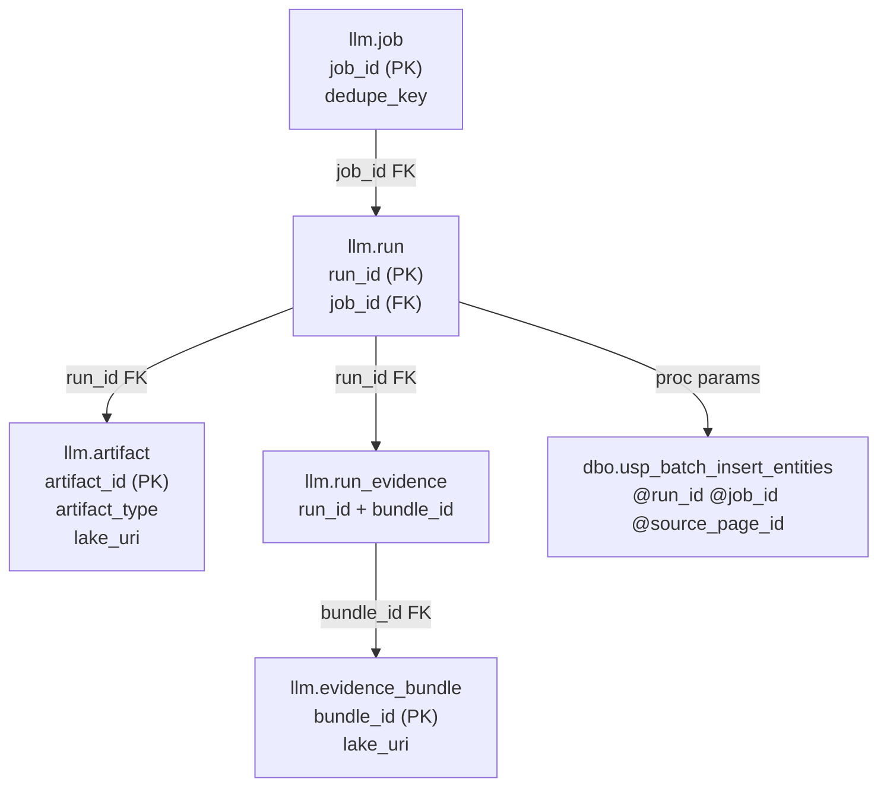

# PR #58: Embed LLM observability visuals directly in current-state doc and add draw.io source set

## Header

| Field | Value |
|---|---|
| **PR Number** | 58 |
| **Title** | Embed LLM observability visuals directly in current-state doc and add draw.io source set |
| **URL** | https://github.com/kyledmorgan/holocron-analytics/pull/58 |
| **State** | merged |
| **Created** | 2026-02-14T18:55:34Z |
| **Updated** | 2026-02-14T19:03:40Z |
| **Merged** | 2026-02-14T19:03:40Z |
| **Base branch** | `working_20260115` |
| **Head branch** | `copilot/add-llm-pipeline-visuals-again` |
| **Merge commit SHA** | `cbe2fc019be54b96951daf466f65c88aa4cfc46f` |

---

## PR Body

The LLM/Ollama observability docs needed developer-friendly visuals for correlation, artifacts, evidence linkage, dedupe/no-op behavior, and SQL boundary mapping. This update keeps visuals in-line with the existing current-state document and adds editable diagram sources for presentation-quality views.

- **In-line visual expansion in current-state doc**
  - Extended `docs/llm/llm-pipeline-observability-current-state.md` with a **Visual Reference Pack** section.
  - Added six GitHub-renderable Mermaid diagrams:
    - system context (Python ↔ Ollama ↔ SQL llm/dbo ↔ lake)
    - correlation chain (`job_id`, `run_id`, `artifact_id`, `bundle_id`, `dedupe_key`, conditional `source_page_id`)
    - artifact lifecycle + `llm.artifact` (`artifact_type -> lake_uri`) mapping
    - evidence linkage (`llm.evidence_bundle` + `llm.run_evidence`)
    - troubleshooting decision tree for “No new rows in dbo”
    - stored procedure boundary for `dbo.usp_batch_insert_entities`
  - Added a compact debugging checklist and a “Discrepancies / to confirm” section for uncertain runtime-path details.

- **Draw.io source assets (diagrams.net)**
  - Added six editable files under `docs/llm/diagrams/`:
    - `llm_observability_system_context.drawio`
    - `llm_observability_correlation_chain.drawio`
    - `llm_observability_artifact_lifecycle.drawio`
    - `llm_observability_evidence_linkage.drawio`
    - `llm_observability_no_new_rows_troubleshooting.drawio`
    - `llm_observability_stored_proc_boundary.drawio`
  - Each diagram uses consistent swimlanes (Python, Ollama, SQL llm, SQL dbo, lake), standardized shapes, title, and legend/callouts for key columns and lake path pattern.

- **Doc-structure alignment**
  - Visuals are intentionally co-located with the current-state document (no separate diagrams markdown).

Example excerpt of the new in-line diagram style:

<!-- START COPILOT CODING AGENT TIPS -->
---

💬 We'd love your input! Share your thoughts on Copilot coding agent in our [2 minute survey](https://gh.io/copilot-coding-agent-survey).

---

## Comments

_No comments._

---

## Review Comments (inline diff)

_No inline review comments._

---

## Copilot Artifacts

_No Copilot artifact indicators detected._
