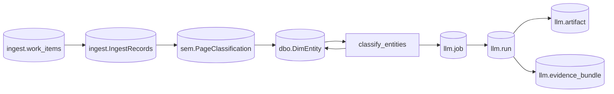

# Data Model Reference

Canonical definitions for the persistent data structures that other documents
link to. Headings on this page are **stable anchor targets** — do not rename
them casually (see
[Documentation and links](../contributing/documentation-and-links.md#stable-headings)).

Each canonical object uses the consistent format described in the
[reference README](README.md#canonical-definition-format). Anchors follow
GitHub's slug rules: `dbo.DimEntity` resolves to `#dbodimentity` (punctuation is
removed, not converted to a hyphen).

**Scope:** This page covers the most-linked, architecturally central objects. It
does **not** duplicate the full column dictionaries in
[ERD Explained](../diagrams/mermaid/ERD_Explained.md); link there for exhaustive
schema detail.

## Contents

- [Schemas](#schemas)
- [dbo.DimEntity](#dbodimentity)
- [ingest.IngestRecords](#ingestingestrecords)
- [ingest.work_items](#ingestwork_items)
- [llm.job](#llmjob)
- [llm.run](#llmrun)
- [llm.artifact](#llmartifact)
- [llm.evidence_bundle](#llmevidence_bundle)
- [sem.PageClassification](#sempageclassification)
- [Relationships](#relationships)

---

## Schemas

| Schema | Domain | Purpose |
| --- | --- | --- |
| `dbo` | Core dimensional model | Conformed dimensions, facts, and bridges (`Dim*`, `Fact*`, `Bridge*`). |
| `ingest` | Ingest and orchestration | Raw fetch records and the resumable work queue. |
| `llm` | LLM and analysis | Job queue, runs, artifacts, evidence bundles, retrieval. |
| `sem` | Entity classification | Page-level signals and type-inference staging. |
| `vector` | Retrieval (legacy) | Superseded by the `llm` schema; retained for back-compat. |

DDL lives under [`src/db/ddl/`](../../src/db/ddl) (base objects) and
[`db/migrations/`](../../db/migrations) (versioned migrations applied by
[`tools/db_init.py`](../../tools/db_init.py)).

---

## dbo.DimEntity

**Kind:** SQL table &nbsp; **Domain:** Core entity model &nbsp; **Status:** Active

**Purpose:**
Identity registry for characters, organizations, locations, and technology
instances. Stores canonical entity records plus their inferred or confirmed
classification attributes (`EntityType`, normalized names, aliases).

**Primary implementation:**
[`src/db/ddl/01_dimensions/009_DimEntity.sql`](../../src/db/ddl/01_dimensions/009_DimEntity.sql)

**Written by:**

- [`classify_entities` CLI](cli-reference.md#classify_entities) — assigns
  `EntityType` and normalized fields via LLM jobs.
- [`dbo.usp_batch_insert_entities`](../../src/db/dml/stored_procedures/dbo.usp_batch_insert_entities.sql)
  — bulk upsert from extraction handlers.

**Read by:**

- entity classification candidate selection
  ([`dbo.usp_get_unclassified_entities`](../../src/db/dml/stored_procedures/dbo.usp_get_unclassified_entities.sql));
- evidence attachment and relationship bridges;
- analytics `mart_*` and `learn_*` views under
  [`src/db/views/`](../../src/db/views).

**Important invariants** (as implemented in the DDL):

- `EntityKey` is the internal surrogate (`INT IDENTITY`); `EntityGuid` is the
  stable public identifier (`UNIQUEIDENTIFIER`, random default).
- Versioned with an SCD Type 2 pattern: `IsLatest`, `IsActive`, `VersionNum`,
  `ValidFromUtc`/`ValidToUtc`, and `RowHash` for change detection.
- `ExternalKey` / `ExternalKeyType` carry source-system identity.

**Related concepts:**

- [`ingest.IngestRecords`](#ingestingestrecords) — upstream raw payloads.
- [Entity classification](README.md#entity-classification-and-resolution).
- [Entity classification resume](../llm/entity-classification-resume.md).

---

## ingest.IngestRecords

**Kind:** SQL table &nbsp; **Domain:** Ingest and orchestration &nbsp; **Status:** Active

> The feature domain often refers to this concept as `ingest.IngestRecord`
> (singular). The implemented table name is **`ingest.IngestRecords`** (plural);
> the Python model is
> [`IngestRecord`](../../src/ingest/core/models.py).

**Purpose:**
Stores raw HTTP fetch results as JSON payloads with minimal metadata for
tracking and deduplication. One row per successful acquisition.

**Primary implementation:**
[`src/db/ddl/00_ingest/002_IngestRecords.sql`](../../src/db/ddl/00_ingest/002_IngestRecords.sql)

**Written by:**

- [`SqlServerIngestWriter`](../../src/ingest/storage/sqlserver.py) during an
  [ingest run](jobs-and-runners.md#ingest-runner).

**Read by:**

- [`sem.SourcePage`](#sempageclassification) (via `latest_ingest_id`);
- evidence sources that hydrate LLM prompts
  ([`src/llm/evidence/sources/`](../../src/llm/evidence/sources)).

**Important invariants:**

- `ingest_id` is a `UNIQUEIDENTIFIER` primary key.
- `source_system` + `resource_type` + `resource_id` + `fetched_at_utc` identify
  a fetch; `hash_sha256` supports deduplication.
- Linked to its originating work unit via `work_item_id`.

**Related concepts:**

- [`ingest.work_items`](#ingestwork_items) — the durable unit of resumable work.

---

## ingest.work_items

**Kind:** SQL table &nbsp; **Domain:** Ingest and orchestration &nbsp; **Status:** Active

> Referred to conceptually as `ingest.WorkItem`. The implemented table is
> **`ingest.work_items`**; the Python model is
> [`WorkItem`](../../src/ingest/core/models.py).

**Purpose:**
Durable queue of resumable ingest work. Each row is a unit of acquisition that a
runner can claim, attempt, retry, and complete.

**Primary implementation:**
[`db/migrations/0002_create_tables.sql`](../../db/migrations/0002_create_tables.sql)
(concurrency and lease columns added in
[`0011_concurrent_runner_support.sql`](../../db/migrations/0011_concurrent_runner_support.sql)).

**Written/claimed by:**

- [Ingest runner](jobs-and-runners.md#ingest-runner) and
  [concurrent runner](jobs-and-runners.md#concurrent-ingest-runner).

**Important invariants:**

- `work_item_id` is the clustered primary key (`NVARCHAR(36)`).
- `status` is constrained to
  `pending | in_progress | completed | failed | skipped`.
- `dedupe_key` enforces idempotent enqueue; `priority` orders the queue;
  `attempt` is non-negative.

**Related concepts:**

- [`ingest.IngestRecords`](#ingestingestrecords) — the result of a completed
  work item.

---

## llm.job

**Kind:** SQL table &nbsp; **Domain:** LLM and analysis &nbsp; **Status:** Active

**Purpose:**
Work queue of LLM derive jobs. Workers claim jobs, run inference, and record the
outcome.

**Primary implementation:**
[`db/migrations/0005_create_llm_tables.sql`](../../db/migrations/0005_create_llm_tables.sql)

**Claimed by:**
[`llm.usp_claim_next_job`](../../src/db/dml/stored_procedures/llm.usp_claim_next_job.sql)
— non-blocking claim using `READPAST` + `UPDLOCK`, ordered by priority then
availability. Driven by the [Phase 1 runner](jobs-and-runners.md#phase-1-llm-runner).

**Important invariants:**

- `status` transitions through `NEW → RUNNING → SUCCEEDED | FAILED | DEADLETTER`.
- `available_utc` gates retry timing; `attempt_count < max_attempts` bounds
  retries; `locked_by` records the claiming worker.

**Related concepts:**

- [`llm.run`](#llmrun) — one execution attempt of a job.
- Queue health: [`llm.vw_queue_health`](../../src/db/views/llm/llm.vw_queue_health.sql).

---

## llm.run

**Kind:** SQL table &nbsp; **Domain:** LLM and analysis &nbsp; **Status:** Active

**Purpose:**
Records an individual LLM execution attempt for a [`llm.job`](#llmjob), including
the model used and full artifact provenance.

**Primary implementation:**
[`db/migrations/0005_create_llm_tables.sql`](../../db/migrations/0005_create_llm_tables.sql);
provenance/lineage columns added in
[`db/migrations/0033_llm_provenance_lineage.sql`](../../db/migrations/0033_llm_provenance_lineage.sql).

**Important invariants (provenance):**

- Links request/response/output artifacts via `request_artifact_id`,
  `response_artifact_id`, `output_artifact_id`, `prompt_rendered_artifact_id`.
- `parent_run_id` chains dependent runs; `run_fingerprint` supports dedup.

**Related concepts:**

- [`llm.artifact`](#llmartifact) — the stored content these IDs reference.
- [`llm.evidence_bundle`](#llmevidence_bundle) — attached via `llm.run_evidence`.

---

## llm.artifact

**Kind:** SQL table &nbsp; **Domain:** LLM and analysis &nbsp; **Status:** Active

**Purpose:**
Stores artifacts produced by a [`llm.run`](#llmrun) — request JSON, raw response,
parsed output, prompt text, or evidence bundle snapshots. The **artifact
version** of a concept is identified by its `content_sha256`.

**Primary implementation:**
[`db/migrations/0005_create_llm_tables.sql`](../../db/migrations/0005_create_llm_tables.sql);
SQL-first storage added in
[`db/migrations/0035_artifact_content_sql_first.sql`](../../db/migrations/0035_artifact_content_sql_first.sql).

**Important invariants:**

- `content_sha256` fingerprints the payload (the version identity).
- SQL-first: `content` may be stored inline (`stored_in_sql`) and optionally
  `mirrored_to_lake` with a nullable `lake_uri`.

**Related concepts:**

- [Lake and artifacts](lake-and-artifacts.md).
- [SQL-first artifact storage](../llm/sql-first-artifact-storage.md).

---

## llm.evidence_bundle

**Kind:** SQL table &nbsp; **Domain:** Evidence and provenance &nbsp; **Status:** Active

**Purpose:**
Tracks the bounded set of evidence assembled for an LLM inference. Bundles are
the auditable input that justifies a derived result.

**Primary implementation:**
[`db/migrations/0007_evidence_bundle_tables.sql`](../../db/migrations/0007_evidence_bundle_tables.sql)
(also defines `llm.run_evidence` and `llm.evidence_item`).

**Important invariants:**

- `bundle_id` is a `UNIQUEIDENTIFIER`; `policy_json` and `summary_json` capture
  selection policy and contents; individual items live in `llm.evidence_item`
  with `content_sha256` and `byte_count`.
- Attached to runs through `llm.run_evidence`.

**Related concepts:**

- [Evidence bundles](../llm/evidence.md) — assembly process and evidence types.
- [Glossary: Evidence Bundle](../llm/glossary.md#evidence-bundle).

---

## sem.PageClassification

**Kind:** SQL table &nbsp; **Domain:** Entity classification &nbsp; **Status:** Active

**Purpose:**
Type inference and lineage for ingested pages: the primary type, confidence,
method (`rules | llm | hybrid | manual`), and the originating `llm.run`.

**Primary implementation:**
[`db/migrations/0017_sem_page_classification.sql`](../../db/migrations/0017_sem_page_classification.sql)

**Read by:**

- [`sem.vw_CurrentPageClassification`](../../src/db/views/sem/sem.vw_CurrentPageClassification.sql)
  and [`sem.vw_EntityCandidates`](../../src/db/views/sem/sem.vw_EntityCandidates.sql).

**Important invariants:**

- `is_current` marks the latest classification per page; `needs_review` flags
  low-confidence rows.
- Taxonomy is versioned via `taxonomy_version` (see
  [Page classification taxonomy v1.1](../page-classification-taxonomy-v1.1.md)).

**Related concepts:**

- [`dbo.DimEntity`](#dbodimentity) — the conformed entity the candidate becomes.

---

## Relationships

- [`ingest.work_items`](#ingestwork_items) tracks resumable acquisition; a
  completed item yields an [`ingest.IngestRecords`](#ingestingestrecords) row.
- [`sem.PageClassification`](#sempageclassification) infers a type, feeding
  candidate entities into [`dbo.DimEntity`](#dbodimentity).
- [`classify_entities`](cli-reference.md#classify_entities) enqueues
  [`llm.job`](#llmjob) rows; each [`llm.run`](#llmrun) records artifacts and the
  [`llm.evidence_bundle`](#llmevidence_bundle) that justified it, then writes the
  curated result back to [`dbo.DimEntity`](#dbodimentity).

For exhaustive column-level documentation, see
[ERD Explained](../diagrams/mermaid/ERD_Explained.md).
