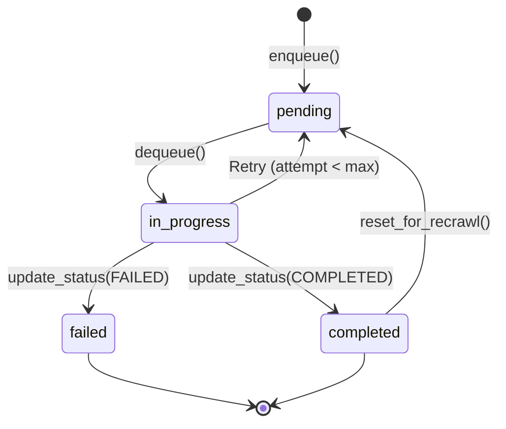

# SQL Server State Store Backend

This document describes the SQL Server-based state store, which is the **default and recommended backend** for the Holocron Analytics ingestion framework.

---

## Table of Contents

1. [Overview](#overview)
2. [Quick Start](#quick-start)
3. [Configuration](#configuration)
4. [Schema Conventions](#schema-conventions)
5. [Running the Smoke Test](#running-the-smoke-test)
6. [How the Runner Uses SQL Server](#how-the-runner-uses-sql-server)
7. [Deduplication and Idempotency](#deduplication-and-idempotency)
8. [Re-Crawl Patterns](#re-crawl-patterns)
9. [Adding New Source Systems](#adding-new-source-systems)
10. [Docker Compose Setup](#docker-compose-setup)
11. [Troubleshooting](#troubleshooting)
12. [Future Work](#future-work)

---

## Overview

The SQL Server state store (`SqlServerStateStore`) provides robust, production-grade state management for the ingestion framework. It offers:

- **Full concurrency support**: Multiple workers can process items simultaneously
- **ACID transactions**: Reliable state updates with proper isolation
- **Deduplication**: Unique constraints prevent duplicate work items
- **Scalability**: Handles millions of work items efficiently
- **Re-crawl support**: Query known resources without re-seeding

**Backend identifier**: `sqlserver`  
**Location**: `src/ingest/state/sqlserver_store.py`  
**Configuration**: Via environment variables or YAML config

---

## Quick Start

### 1. Start SQL Server (Docker)

```bash
# Start SQL Server container
docker compose up -d sqlserver

# Wait for healthy status
docker compose ps
```

### 2. Set Environment Variables

```bash
# Required
export MSSQL_SA_PASSWORD="YourStrongPassword123!"

# Optional (defaults shown)
export DB_BACKEND=sqlserver
export INGEST_SQLSERVER_HOST=localhost
export INGEST_SQLSERVER_PORT=1433
export INGEST_SQLSERVER_DATABASE=Holocron
export INGEST_SQLSERVER_USER=sa
export INGEST_SQLSERVER_PASSWORD="YourStrongPassword123!"
export INGEST_SQLSERVER_SCHEMA=ingest
```

### 3. Run Smoke Test

```bash
python scripts/db/db_smoketest.py
```

Expected output:
```
✓ Connection established successfully
✓ Schema and tables verified
✓ Write/read operations successful
✓ Deduplication working correctly
✓ All smoke tests passed!
```

### 4. Run Ingestion

```bash
# Seed and run
python src/ingest/ingest_cli.py --config config/ingest.yaml --seed --max-items 10
```

---

## Configuration

### Environment Variables

| Variable | Default | Description |
|----------|---------|-------------|
| `DB_BACKEND` | `sqlserver` | Backend type (`sqlserver` or `sqlite`) |
| `INGEST_SQLSERVER_HOST` | `localhost` | SQL Server hostname |
| `INGEST_SQLSERVER_PORT` | `1433` | SQL Server port |
| `INGEST_SQLSERVER_DATABASE` | `Holocron` | Database name |
| `INGEST_SQLSERVER_USER` | `sa` | Database username |
| `INGEST_SQLSERVER_PASSWORD` | (required) | Database password |
| `INGEST_SQLSERVER_DRIVER` | `ODBC Driver 18 for SQL Server` | ODBC driver |
| `INGEST_SQLSERVER_SCHEMA` | `ingest` | Schema name for tables |
| `INGEST_SQLSERVER_STATE_CONN_STR` | (optional) | Full ODBC connection string |

### YAML Configuration

```yaml
# config/ingest.yaml
state:
  type: "sqlserver"
  
  sqlserver:
    host: "localhost"
    port: 1433
    database: "Holocron"
    user: "sa"
    # password: (use environment variable)
    driver: "ODBC Driver 18 for SQL Server"
    schema: "ingest"
```

### Connection String Format

If you prefer a full connection string:

```
Driver={ODBC Driver 18 for SQL Server};Server=localhost,1433;Database=Holocron;UID=sa;PWD=YourPassword;TrustServerCertificate=yes
```

---

## Schema Conventions

### Schema-Based Partitioning

All state store tables are created in the `ingest` schema by default:

```sql
-- Schema creation (idempotent)
IF NOT EXISTS (SELECT * FROM sys.schemas WHERE name = 'ingest')
    EXEC('CREATE SCHEMA [ingest]')
```

### Tables

#### `ingest.work_items`

Main table for work queue and state tracking.

```sql
CREATE TABLE [ingest].[work_items] (
    work_item_id NVARCHAR(36) PRIMARY KEY,
    source_system NVARCHAR(100) NOT NULL,
    source_name NVARCHAR(100) NOT NULL,
    resource_type NVARCHAR(100) NOT NULL,
    resource_id NVARCHAR(500) NOT NULL,
    request_uri NVARCHAR(2000) NOT NULL,
    request_method NVARCHAR(10) NOT NULL,
    request_headers NVARCHAR(MAX),
    request_body NVARCHAR(MAX),
    metadata NVARCHAR(MAX),
    priority INT NOT NULL DEFAULT 100,
    status NVARCHAR(20) NOT NULL,
    attempt INT NOT NULL DEFAULT 0,
    run_id NVARCHAR(36),
    discovered_from NVARCHAR(36),
    created_at DATETIME2 NOT NULL,
    updated_at DATETIME2 NOT NULL,
    error_message NVARCHAR(MAX),
    dedupe_key NVARCHAR(800) NOT NULL
);
```

### Indexes

```sql
-- Queue dequeue optimization
CREATE INDEX ix_work_items_status 
ON [ingest].[work_items] (status, priority, created_at);

-- Deduplication (unique constraint)
CREATE UNIQUE INDEX ix_work_items_dedupe 
ON [ingest].[work_items] (dedupe_key);

-- Run-based queries
CREATE INDEX ix_work_items_run_id 
ON [ingest].[work_items] (run_id);

-- Source filtering (for re-crawl)
CREATE INDEX ix_work_items_source 
ON [ingest].[work_items] (source_system, source_name);
```

---

## Running the Smoke Test

The smoke test verifies SQL Server connectivity and basic operations.

### Run Manually

```bash
# Ensure environment is configured
export MSSQL_SA_PASSWORD="YourPassword"

# Run smoke test
python scripts/db/db_smoketest.py
```

### What It Tests

1. **Connection**: Establishes connection to SQL Server
2. **Schema**: Verifies schema and tables exist
3. **Write/Read**: Enqueues, retrieves, and updates work items
4. **Dedupe**: Verifies duplicate rejection works

### Sample Output

```
╔════════════════════════════════════════════════════════════╗
║       SQL Server State Store - Smoke Test                  ║
╚════════════════════════════════════════════════════════════╝

============================================================
SQL Server Connection Info
============================================================
  Host:     localhost
  Port:     1433
  Database: Holocron
  Username: sa
  Driver:   ODBC Driver 18 for SQL Server
  Schema:   ingest
  Password: ***
============================================================
Test 1: Establishing connection...
✓ Connection established successfully
Test 2: Verifying schema creation...
✓ Schema and tables verified
Test 3: Testing write/read operations...
  - Enqueued work item: abc-123-...
  - Verified work item exists
  - Retrieved work item successfully
  - Updated status to COMPLETED
✓ Write/read operations successful
Test 4: Testing deduplication...
  - First enqueue succeeded
  - Second enqueue correctly rejected (dedupe working)
✓ Deduplication working correctly

============================================================
✓ All smoke tests passed!
  SQL Server state store is ready for use.
```

---

## How the Runner Uses SQL Server

### Initialization

```python
from ingest.state import create_state_store

# Factory function selects backend based on DB_BACKEND env var
state_store = create_state_store()

# Or explicitly:
state_store = create_state_store(
    backend="sqlserver",
    host="localhost",
    database="Holocron",
    password="YourPassword",
)
```

### Work Item Lifecycle



### Key Operations

| Method | SQL Operation | Purpose |
|--------|---------------|---------|
| `enqueue()` | INSERT | Add work item (with dedupe) |
| `dequeue(limit)` | SELECT TOP + UPDATE | Get pending items |
| `update_status()` | UPDATE | Mark completed/failed |
| `exists()` | SELECT TOP 1 | Check dedupe key |
| `get_stats()` | GROUP BY COUNT | Get queue statistics |
| `get_known_resources()` | SELECT with filters | Query for re-crawl |
| `reset_for_recrawl()` | UPDATE | Reset completed items to pending |

---

## Deduplication and Idempotency

### Dedupe Key Format

```
{source_system}:{source_name}:{resource_type}:{resource_id}
```

Examples:
- `mediawiki:wikipedia:page:Star_Wars`
- `mediawiki:wookieepedia:page:Luke_Skywalker`
- `openalex:works:work:W2741809807`

### Enforcement

1. **Unique Index**: `ix_work_items_dedupe` prevents duplicate keys
2. **Pre-Check**: `exists()` called before insert
3. **Race Condition Handling**: `IntegrityError` caught and returns `False`

### Idempotent Operations

- **Enqueue**: Safe to call multiple times; duplicates silently rejected
- **Update**: Safe to retry; last write wins
- **Dequeue**: Atomic status update prevents double-processing

---

## Re-Crawl Patterns

### Pattern 1: Query Known Resources

Fetch previously seen resources without re-seeding:

```python
# Get all completed items for a source
known_items = state_store.get_known_resources(
    source_system="mediawiki",
    source_name="wookieepedia",
    status=WorkItemStatus.COMPLETED
)

# Re-process specific items
for item in known_items:
    if should_refresh(item):
        state_store.update_status(item.work_item_id, WorkItemStatus.PENDING)
```

### Pattern 2: Bulk Reset

Reset all completed items for re-crawl:

```python
# Reset all completed items for a source
count = state_store.reset_for_recrawl(
    source_system="mediawiki",
    source_name="wookieepedia"
)
print(f"Reset {count} items for re-crawl")
```

### Pattern 3: Direct SQL Query

For advanced queries, access the connection directly:

```python
cursor = state_store.conn.cursor()
cursor.execute("""
    SELECT resource_id, updated_at 
    FROM [ingest].[work_items]
    WHERE source_name = ?
    AND status = 'completed'
    AND updated_at < DATEADD(day, -30, GETUTCDATE())
""", ("wookieepedia",))

stale_items = cursor.fetchall()
```

---

## Adding New Source Systems

### Step 1: Define Source Configuration

```yaml
# config/ingest.yaml
sources:
  - name: "my_new_api"
    type: "http"
    base_url: "https://api.example.com"
    rate_limit_delay: 1.0
```

### Step 2: Create Connector (if needed)

```python
# src/ingest/connectors/my_connector.py
class MyApiConnector(Connector):
    def fetch(self, request: ConnectorRequest) -> ConnectorResponse:
        # Implementation
```

### Step 3: Ensure Unique Resource IDs

The dedupe key uses `resource_id`. Ensure your source provides unique identifiers:

```python
work_item = WorkItem(
    source_system="my_api",      # Unique per API type
    source_name="production",     # Instance identifier
    resource_type="record",       # Resource category
    resource_id="rec_12345",      # Must be unique within above scope
    request_uri="https://...",
)
```

### Step 4: Add Discovery (Optional)

```python
# src/ingest/discovery/my_discovery.py
class MyApiDiscovery(Discovery):
    def discover(self, record: IngestRecord, work_item: WorkItem) -> List[WorkItem]:
        # Extract linked resources from response
```

### Uniqueness Constraints by Source

| Source System | Recommended resource_id | Example |
|---------------|------------------------|---------|
| MediaWiki | Page title | `Star_Wars` |
| OpenAlex | Work/Author ID | `W2741809807` |
| HTTP/Generic | URL hash or path | `/api/v1/records/123` |
| Custom API | External ID | `rec_12345` |

---

## Docker Compose Setup

### docker-compose.yml (Excerpt)

```yaml
services:
  sqlserver:
    image: mcr.microsoft.com/mssql/server:2022-latest
    container_name: holocron-sqlserver
    environment:
      - ACCEPT_EULA=Y
      - MSSQL_PID=Developer
      - MSSQL_SA_PASSWORD=${MSSQL_SA_PASSWORD}
    ports:
      - "1433:1433"
    volumes:
      - mssql_data:/var/opt/mssql
    healthcheck:
      test: ["CMD-SHELL", "bash -c \"echo > /dev/tcp/localhost/1433\""]
      interval: 10s
      timeout: 5s
      retries: 12
      start_period: 30s
    restart: unless-stopped

volumes:
  mssql_data:
    driver: local
```

### Starting the Stack

```bash
# Set password (required)
export MSSQL_SA_PASSWORD="YourStrongPassword123!"

# Start SQL Server
docker compose up -d sqlserver

# Wait for healthy
docker compose ps

# Run smoke test
python scripts/db/db_smoketest.py
```

### Healthcheck Details

The healthcheck verifies TCP connectivity:
- **Interval**: 10 seconds between checks
- **Timeout**: 5 seconds per check
- **Retries**: 12 attempts before unhealthy
- **Start Period**: 30 seconds grace period for startup

---

## Troubleshooting

### Connection Refused

```
pyodbc.Error: ('08001', '[08001] [Microsoft][ODBC Driver 18 for SQL Server]TCP Provider: Error code 0x2749')
```

**Solutions**:
1. Ensure SQL Server is running: `docker compose ps`
2. Check port mapping: `docker port holocron-sqlserver`
3. Wait for healthcheck: SQL Server takes 30+ seconds to start

### Driver Not Found

```
pyodbc.Error: ('01000', "[01000] [unixODBC][Driver Manager]Can't open lib 'ODBC Driver 18 for SQL Server'")
```

**Solutions**:
1. Install ODBC driver: See [Microsoft ODBC docs](https://docs.microsoft.com/en-us/sql/connect/odbc/linux-mac/installing-the-microsoft-odbc-driver-for-sql-server)
2. On macOS: `brew install msodbcsql18`
3. On Ubuntu: Follow Microsoft's apt repository instructions

### Login Failed

```
pyodbc.Error: ('28000', "[28000] [Microsoft][ODBC Driver 18 for SQL Server][SQL Server]Login failed for user 'sa'")
```

**Solutions**:
1. Check password meets complexity requirements (uppercase, lowercase, number, special char, 8+ chars)
2. Verify `MSSQL_SA_PASSWORD` environment variable is set
3. Wait for SQL Server to fully initialize

### Certificate Error

```
SSL Provider: Error:0A000438:SSL routines::tlsv1 alert internal error
```

**Solution**: Ensure `TrustServerCertificate=yes` is in connection string (already configured by default).

---

## Future Work

### Not Yet Implemented

1. **Connection Pooling**: Currently uses single connection per store instance
2. **Stored Procedures**: Could improve performance for complex operations
3. **Partitioning**: Large tables could benefit from date-based partitioning
4. **Retention Policies**: Auto-cleanup of old completed items
5. **Metrics/Monitoring**: Prometheus-style metrics export

### Planned Enhancements

- Run lineage tracking (parent runs, versioned result sets)
- Batch insert optimization
- Read replica support for stats queries
- Integration with SQL Server Agent for scheduled jobs

---

## See Also

- [Deprecated SQLite Documentation](deprecated/sqlite-state-store.md)
- [Ingestion Framework README](../src/ingest/README.md)
- [Configuration Examples](../config/ingest.example.yaml)
